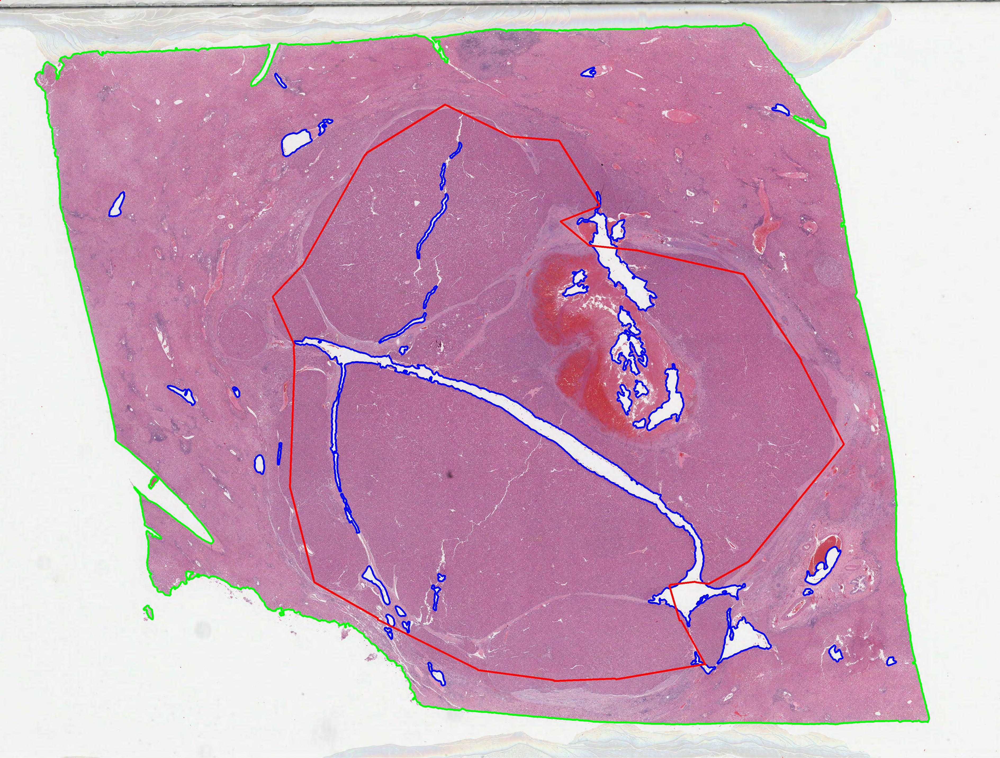

# Predict Immune and Inflammatory Gene Signature Expression Directly from Histology Images 


**Predict 6 gene signatures associated with response to nivolumab and survival in advanced hepatocellular carcinoma (HCC) from [Sangro, Bruno, et al](https://pubmed.ncbi.nlm.nih.gov/32710922/).**
- ***6-Gene Interferon Gamma** ([Ayers, Mark, et al.](https://pubmed.ncbi.nlm.nih.gov/28650338/))* 
- ***Gajewski 13-Gene Inflammatory** ([Spranger, Stefani, Riyue Bao, and Thomas F. Gajewski.](https://pubmed.ncbi.nlm.nih.gov/25970248/))*
- ***Inflammatory** ([Sangro, Bruno, et al](https://pubmed.ncbi.nlm.nih.gov/32710922/))* 
- ***Interferon Gamma Biology** ([Ayers, Mark, et al.](https://pubmed.ncbi.nlm.nih.gov/28650338/))* 
- ***Ribas 10-Gene Interferon Gamma** ([Ayers, Mark, et al.](https://pubmed.ncbi.nlm.nih.gov/28650338/))* 
- ***T-cell Exhaustion** ([Ayers, Mark, et al.](https://pubmed.ncbi.nlm.nih.gov/28650338/))* 

Hierarchical clustering was performed on the gene expression data to generate labels for Whole Slide Images (WSIs). The deep learning models were trained (60%) with 10-fold Monte-carlo cross validation (20%) and tested (20%) on the [TCGA LIHC dataset](https://portal.gdc.cancer.gov/projects/TCGA-LIHC). Our in-house dataset (from APHP Henri Mondor) was then used for external validation. Results using tumoral annotations (regions of interest drawn by our expert pathologist)  are superior to those using all the tissue regions.

Of note, the discovery series was stained with hematein-eosin (H&E) while external validation series was stained with hematein-eosin-saffron (HES). Thus we tested stain unmixing (3 methods implemented: Macenko PCA or XU SNMF or a fixed HES vector) and saffron removal for external validation series. Color noralization (2 methods: Reinhard or Macenco PCA) was also tested for both discovery and validation series. Furthermore, on-the-fly basic geometric augmentation were also tested during the training.


**3 Deep learning approaches:**
- *Patch-based* ([original repo](https://github.com/jnkather/DeepHistology))
- *2 Multiple Instance Learning (MIL): CLAM and classic MIL* ([original repo](https://github.com/mahmoodlab/CLAM))

Results
===========
**AUROC in the discovery series (TCGA-LIHC) with/without tumoral annotations:**

<table  align="center">
	<tbody>
		<tr>
			<td align="center" valign="center" rowspan="2"><b><sub>Gene signature<sub></td>
			<td align="center" valign="center" rowspan="2"><b><sub>tumor annot<sub></td>
			<td align="center" valign="center" colspan="2"><b><sub>Patch-based<sub></td>
			<td align="center" valign="center" colspan="2"><b><sub>Classic MIL<sub></td>
			<td align="center" valign="center" colspan="2"><b><sub>CLAM<sub></td>
		</tr>
		<tr>
			<td align="center" valign="center"><b><sub>Best fold<sub></td>
			<td align="center" valign="center"><b><sub>Mean ± sd<sub></td>
			<td align="center" valign="center"><b><sub>Best fold<sub></td>
			<td align="center" valign="center"><b><sub>Mean ± sd<sub></td>
			<td align="center" valign="center"><b><sub>Best fold<sub></td>
			<td align="center" valign="center"><b><sub>Mean ± sd<sub></td>
		</tr>
		<tr>
			<td align="center" valign="center" rowspan="2"><b><sub>6G Interferon Gamma<sub></td>
			<td align="center" valign="center"><sub>:x:<sub></td>
			<td align="center" valign="center"><sub>0.578<sub></td>
			<td align="center" valign="center"><sub>0.492 ± 0.065<sub></td>
			<td align="center" valign="center"><sub>0.690<sub></td>
			<td align="center" valign="center"><sub>0.576 ± 0.102<sub></td>
			<td align="center" valign="center"><sub>0.734<sub></td>
			<td align="center" valign="center"><sub>0.600 ± 0.080<sub></td>
		</tr>
		<tr>
			<td align="center" valign="center"><sub>:heavy_check_mark:<sub></td>	
			<td align="center" valign="center"><sub>0.661<sub></td>
			<td align="center" valign="center"><sub>0.560 ± 0.067<sub></td>
			<td align="center" valign="center"><sub>0.758<sub></td>
			<td align="center" valign="center"><sub>0.630 ± 0.078<sub></td>
			<td align="center" valign="center"><sub>0.780<sub></td>
			<td align="center" valign="center"><sub>0.635 ± 0.097<sub></td>
		</tr>
		<tr>
			<td align="center" valign="center" rowspan="2"><b><sub>Gajewski 13G Inflammatory<sub></td>
			<td align="center" valign="center"><sub>:x:<sub></td>
			<td align="center" valign="center"><b><sub>0.780<sub></td>
			<td align="center" valign="center"><b><sub>0.666 ± 0.072<sub></td>
			<td align="center" valign="center"><b><sub>0.851<sub></td>
			<td align="center" valign="center"><b><sub>0.577 ± 0.179<sub></td>
			<td align="center" valign="center"><b><sub>0.824<sub></td>
			<td align="center" valign="center"><b><sub>0.632 ± 0.107<sub><sub></td>
		</tr>
		<tr>
			<td align="center" valign="center"><sub>:heavy_check_mark:<sub></td>	
			<td align="center" valign="center"><b><sub>0.809<sub></td>
			<td align="center" valign="center"><b><sub>0.688 ± 0.062<sub></td>
			<td align="center" valign="center"><b><sub>0.893<sub></td>
			<td align="center" valign="center"><b><sub>0.694 ± 0.125<sub></td>
			<td align="center" valign="center"><b><sub>0.914<sub></td>
			<td align="center" valign="center"><b><sub>0.728 ± 0.096<sub><sub></td>
		</tr>
		<tr>
			<td align="center" valign="center" rowspan="2"><b><sub>Inflammatory<sub></td>
			<td align="center" valign="center"><sub>:x:<sub></td>
			<td align="center" valign="center"><sub>0.673<sub></td>
			<td align="center" valign="center"><sub>0.523 ± 0.079<sub></td>
			<td align="center" valign="center"><sub>0.717<sub></td>
			<td align="center" valign="center"><sub>0.539 ± 0.139<sub></td>
			<td align="center" valign="center"><sub>0.738<sub></td>
			<td align="center" valign="center"><sub>0.607 ± 0.090<sub></td>
		</tr>
		<tr>
			<td align="center" valign="center"><sub>:heavy_check_mark:<sub></td>	
			<td align="center" valign="center"><sub>0.706<sub></td>
			<td align="center" valign="center"><sub>0.580 ± 0.077<sub></td>
			<td align="center" valign="center"><sub>0.806<sub></td>
			<td align="center" valign="center"><sub>0.641 ± 0.123<sub></td>
			<td align="center" valign="center"><sub>0.796<sub></td>
			<td align="center" valign="center"><sub>0.665 ± 0.081<sub></td>
		</tr>
		<tr>
			<td align="center" valign="center" rowspan="2"><b><sub>Interferon Gamma biology<sub></td>
			<td align="center" valign="center"><sub>:x:<sub></td>
			<td align="center" valign="center"><sub>0.700<sub></td>
			<td align="center" valign="center"><sub>0.541 ± 0.088<sub></td>
			<td align="center" valign="center"><sub>0.672<sub></td>
			<td align="center" valign="center"><sub>0.562 ± 0.117<sub></td>
			<td align="center" valign="center"><sub>0.759<sub></td>
			<td align="center" valign="center"><sub>0.622 ± 0.088<sub></td>
		</tr>
		<tr>
			<td align="center" valign="center"><sub>:heavy_check_mark:<sub></td>	
			<td align="center" valign="center"><sub>0.783<sub></td>
			<td align="center" valign="center"><sub>0.561 ± 0.119<sub></td>
			<td align="center" valign="center"><sub>0.677<sub></td>
			<td align="center" valign="center"><sub>0.610 ± 0.051<sub></td>
			<td align="center" valign="center"><sub>0.822<sub></td>
			<td align="center" valign="center"><sub>0.674 ± 0.102<sub></td>
		</tr>
		<tr>
			<td align="center" valign="center" rowspan="2"><b><sub>Ribas 10G Inflammatory<sub></td>
			<td align="center" valign="center"><sub>:x:<sub></td>
			<td align="center" valign="center"><sub>0.672<sub></td>
			<td align="center" valign="center"><sub>0.583 ± 0.081<sub></td>
			<td align="center" valign="center"><sub>0.652<sub></td>
			<td align="center" valign="center"><sub>0.552 ± 0.083<sub></td>
			<td align="center" valign="center"><sub>0.758<sub></td>
			<td align="center" valign="center"><sub>0.627 ± 0.082<sub></td>
		</tr>
		<tr>
			<td align="center" valign="center"><sub>:heavy_check_mark:<sub></td>	
			<td align="center" valign="center"><sub>0.727<sub></td>
			<td align="center" valign="center"><sub>0.640 ± 0.074<sub></td>
			<td align="center" valign="center"><sub>0.726<sub></td>
			<td align="center" valign="center"><sub>0.618 ± 0.065<sub></td>
			<td align="center" valign="center"><sub>0.806<sub></td>
			<td align="center" valign="center"><sub>0.669 ± 0.067<sub></td>
		</tr>
		<tr>
			<td align="center" valign="center" rowspan="2"><b><sub>T cell exhaustion<sub></td>
			<td align="center" valign="center"><sub>:x:<sub></td>
			<td align="center" valign="center"><sub>0.661<sub></td>
			<td align="center" valign="center"><sub>0.490 ± 0.108<sub><sub></td>
			<td align="center" valign="center"><sub>0.744<sub></td>
			<td align="center" valign="center"><sub>0.516 ± 0.123<sub></td>
			<td align="center" valign="center"><sub>0.627<sub></td>
			<td align="center" valign="center"><sub>0.555 ± 0.063<sub></td>
		</tr>
		<tr>
			<td align="center" valign="center"><sub>:heavy_check_mark:<sub></td>	
			<td align="center" valign="center"><sub>0.661<sub></td>
			<td align="center" valign="center"><sub>0.543 ± 0.073<sub><sub></td>
			<td align="center" valign="center"><sub>0.788<sub></td>
			<td align="center" valign="center"><sub>0.606 ± 0.086<sub></td>
			<td align="center" valign="center"><sub>0.788<sub></td>
			<td align="center" valign="center"><sub>0.577 ± 0.092<sub></td>
		</tr>
	</tbody>
</table>

**AUROC (of best-fold model) in the external validation series (Mondor) with tumoral anotations:**

<table  align="center">
	<tbody>
		<tr>
			<td align="center" valign="center"><b><sub>Gene signature (with tumor annot :heavy_check_mark:)<sub></td>
			<td align="center" valign="center"><b><sub>Patch-based<sub></td>
			<td align="center" valign="center"><b><sub>Classic MIL<sub></td>
			<td align="center" valign="center"><b><sub>CLAM<sub></td>
		</tr>
		<tr>
			<td align="center" valign="center"><b><sub>6G Interferon Gamma<sub></td>
			<td align="center" valign="center"><sub>0.694<sub></td>
			<td align="center" valign="center"><sub>0.745<sub></td>
			<td align="center" valign="center"><sub>0.871<sub></td>
		</tr>
		<tr>
			<td align="center" valign="center"><b><sub>Gajewski 13G Inflammatory<sub></td>
			<td align="center" valign="center"><sub>0.657<sub></td>
			<td align="center" valign="center"><sub>0.782<sub></td>
			<td align="center" valign="center"><sub>0.810<sub></td>
		</tr>
		<tr>
			<td align="center" valign="center"><b><sub>Inflammatory<sub></td>
			<td align="center" valign="center"><sub>0.657<sub></td>
			<td align="center" valign="center"><sub>0.816<sub></td>
			<td align="center" valign="center"><sub>0.850<sub></td>
		</tr>
		<tr>
			<td align="center" valign="center"><b><sub>Interferon Gamma biology<sub></td>
			<td align="center" valign="center"><sub>0.755<sub></td>
			<td align="center" valign="center"><sub>0.793<sub></td>
			<td align="center" valign="center"><sub>0.823<sub></td>
		</tr>
		<tr>
			<td align="center" valign="center"><b><sub>Ribas 10G Inflammatory<sub></td>
			<td align="center" valign="center"><sub>0.605<sub></td>
			<td align="center" valign="center"><sub>0.779<sub></td>
			<td align="center" valign="center"><sub>0.810<sub></td>
		</tr>
		<tr>
			<td align="center" valign="center"><b><sub>T cell exhaustion<sub></td>
			<td align="center" valign="center"><b><sub>0.810<sub></td>
			<td align="center" valign="center"><b><sub>0.868<sub></td>
			<td align="center" valign="center"><b><sub>0.921<sub></td>
		</tr>
	</tbody>
</table>

**Visualization / exlainability:**


Workflow
===========


## Part 1. Gene expression clustering 
***To generate labels for WSIs***
1. Process TCGA FPKM data with **gene_clust/codes/tcga_fpkm_processing.ipynb**
2. Perform hierarchical clustering with **gene_clust/codes/PlotHeatmapGeneSignature.R** (to reproduce the heatmap). Or using Python with **gene_clust/codes/tcga_fpkm_clustering.ipynb** (to get the same clustering results)

*All TCGA data used and clutering results are provided in **gene_clust/data** and **gene_clust/results**. Due to privacy issues, the data in Mondor series is not provided but commands for external validation are described in this [tutorial](https://github.com/qinghezeng/CLAM/blob/master/external_validation.md).*

## Part 2. Deep learning
***To classify WSIs***
### Label preparation
1. Preprare sample labels for each gene signature with **gene_clust/codes/tcga_label_csv_for_clam.ipynb**
2. Dataset splitting: (gene signature *Inflammatory* used as an example for the following steps)
```shell
python create_splits_seq.py --task tcga_hcc_349_Inflammatory_cv_highvsrest_622 --seed 1 --label_frac 1 --k 10
```

### WSI preparation
1. Rough annotations of tumoral regions are provided in **data/annotations**. Tissue segmentation and patch extraction: 

For patch extraction, there are 2 options according to the original CLAM repository. Either to save both patch coordinates and images, or only save only patch coordinates. The second option is named fp workflow, which helps to save storage space for large dataset or multiple modified patch versions.

For 20x WSIs
```shell
python create_patches_fp.py --source PATH_TO_TCGA_WSI --save_dir results --patch_size 256 --step_size 256 --seg --patch_level 0 --process_list process_list_edited_20x.csv --patch --stitch --mask_save_dir results/masks_tumor --patch_save_dir results/patches_tumor_masked --stitch_save_dir results/stitches_tumor_masked --use_annotations --annotation_type txt --annotation_dir data/annotations
```
For 40x WSIs
```shell
python create_patches_fp.py --source PATH_TO_TCGA_WSI --save_dir results --patch_size 256 --step_size 256 --seg --patch_level 0 --custom_downsample 2 --process_list process_list_edited_40x.csv --patch --stitch --mask_save_dir results/masks_tumor --patch_save_dir results/patches_tumor_masked --stitch_save_dir results/stitches_tumor_masked --use_annotations --annotation_type txt --annotation_dir data/annotations
```
For 20x WSIs with fp workflow
```shell
python create_patches_fp.py --source PATH_TO_TCGA_WSI --save_dir results --patch_size 256 --step_size 256 --seg --patch_level 0 --process_list process_list_edited_20x.csv --patch --stitch --mask_save_dir results/masks_tumor --patch_save_dir results/patches_tumor_masked --stitch_save_dir results/stitches_tumor_masked --use_annotations --annotation_type txt --annotation_dir data/annotations
```
For 40x WSIs with fp workflow
```shell
python create_patches_fp.py --source PATH_TO_TCGA_WSI --save_dir results --patch_size 256 --step_size 256 --seg --patch_level 0 --custom_downsample 2 --process_list process_list_edited_40x.csv --patch --stitch --mask_save_dir results/masks_tumor --patch_save_dir results/patches_tumor_masked --stitch_save_dir results/stitches_tumor_masked --use_annotations --annotation_type txt --annotation_dir data/annotations
```



Segmention and stitched results will be saved in **results**. Please find in [results/patches_tumor_masked](https://github.com/qinghezeng/CLAM/tree/master/results/patches_tumor_masked) some patch examples (to play with the follwoing steps). 

A segmentation example presented on the right (green --> tissue, blue --> holes, red --> tumor).

***
### Approach 1: Patch-based strategy
#### Reference
*Kather, J. N., Heij, L. R., Grabsch, H. I., Loeffler, C., Echle, A., Muti, H. S., ... & Luedde, T. (2020). Pan-cancer image-based detection of clinically actionable genetic alterations. Nature cancer, 1(8), 789-799.*

#### Installation
OS: Linux (Tested on Ubuntu 18.04)
1. Install Anaconda with Python 3 via [https://www.anaconda.com/distribution/](https://www.anaconda.com/distribution/)
2. Install *openslide*:
```shell
sudo apt-get install openslide-tools
```
3. Create a conda environment with **deepai.yml**: (to use ShuffleNet, we need a higher pytorch version than that of CLAM environment described below)
```shell
conda env create -n clam -f docs/deepai.yaml
```
4. Activate the conda environment:
```shell
conda activate deepai
```
5. Deactivate the conda environment when finishing the experiments:
```shell
conda deactivate
```

#### Training
```shell
CUDA_VISIBLE_DEVICES=0 python train_customed_models.py --early_stopping --patience 2 --min_epochs 5 --lr 5e-5 --reg 1e-5 --opt adam --batch_size 128 --seed 1 --k 10 --k_start -1 --k_end 10 --label_frac 1 --data_dir ./results/patches_tumor_masked --trnsfrms imagenet --results_dir ./results/training_custom_tumor_masked --exp_code tcga_hcc_tumor-masked_349_Inflammatory_cv_highvsrest_622_shufflenet_frz3_imagenet --train_weighting --bag_loss ce --task tcga_hcc_349_Inflammatory_cv_highvsrest_622 --model_type shufflenet --freeze 3 --log_data > log_Inflammatory_shufflenet_frz3_imagenet.txt
```
For fp workflow
```shell
CUDA_VISIBLE_DEVICES=0 python train_customed_models_fp.py --early_stopping --patience 2 --min_epochs 5 --lr 5e-5 --reg 1e-5 --opt adam --batch_size 128 --seed 1 --k 10 --k_start -1 --k_end 10 --label_frac 1 --data_dir ./results/patches_tumor_masked --data_slide_dir PATH_TO_TCGA_WSI --target_patch_size 256 --trnsfrms imagenet --results_dir ./results/training_custom_tumor_masked --exp_code tcga_hcc_tumor-masked_349_Inflammatory_cv_highvsrest_622_shufflenet_frz3_imagenet --train_weighting --bag_loss ce --task tcga_hcc_349_Inflammatory_cv_highvsrest_622 --model_type shufflenet --freeze 3 --log_data > log_Inflammatory_shufflenet_frz3_imagenet.txt
```
#### Inference
```shell
CUDA_VISIBLE_DEVICES=0 python eval_customed_models.py --batch_size 128 --seed 1 --k 10 --k_start -1 --k_end 10 --data_dir ./results/patches_tumor_masked --trnsfrms imagenet --results_dir ./results/training_custom_tumor_masked --eval_dir ./eval_results_349_custom_tumor_masked --save_exp_code tcga_hcc_tumor-masked_349_Inflammatory_cv_highvsrest_622_shufflenet_frz3_imagenet_s1_cv --models_exp_code tcga_hcc_tumor-masked_349_Inflammatory_cv_highvsrest_622_shufflenet_frz3_imagenet_s1 --task tcga_hcc_349_Inflammatory_cv_highvsrest_622 --model_type shufflenet --split test
```
For fp workflow
```shell
CUDA_VISIBLE_DEVICES=0 python eval_customed_models_fp.py --batch_size 128 --seed 1 --k 10 --k_start -1 --k_end 10 --data_slide_dir PATH_TO_TCGA_WSI --data_dir ./results/patches_tumor_masked --trnsfrms imagenet --results_dir ./results/training_custom_tumor_masked --eval_dir ./eval_results_349_custom_tumor_masked --save_exp_code tcga_hcc_tumor-masked_349_Inflammatory_cv_highvsrest_622_shufflenet_frz3_imagenet_s1_cv --models_exp_code tcga_hcc_tumor-masked_349_Inflammatory_cv_highvsrest_622_shufflenet_frz3_imagenet_s1 --task tcga_hcc_349_Inflammatory_cv_highvsrest_622 --model_type shufflenet --split test --target_patch_size 256
```

#### External validation
For fp workflow
```shell
CUDA_VISIBLE_DEVICES=0 python -u eval_customed_models_fp.py --batch_size 128 --seed 1 --k 10 --k_start -1 --k_end 10 --data_slide_dir PATH_TO_MONDOR_WSI --data_dir ./results/patches_mondor_tumor_masked --trnsfrms imagenet --results_dir ./results/training_custom_tumor_masked --eval_dir ./eval_results_349_custom_tumor_masked --save_exp_code mondor_hcc_tumor-masked_139_Inflammatory_cv_highvsrest_00X_shufflenet_frz3_imagenet_s1_cv --models_exp_code tcga_hcc_tumor-masked_349_Inflammatory_cv_highvsrest_622_shufflenet_frz3_imagenet_s1 --task mondor_hcc_139_Inflammatory_cv_highvsrest_00X --model_type shufflenet --split test --target_patch_size 256 --splits_dir ./splits/mondor_hcc_139_Inflammatory_cv_highvsrest_00X_100
```

#### WSI-level Aggregation
```shell
CUDA_VISIBLE_DEVICES=0 python eval_customed_models_slide_aggregation.py --eval_dir ./eval_results_349_custom_tumor_masked --save_exp_code EVAL_tcga_hcc_tumor-masked_349_Inflammatory_cv_highvsrest_622_shufflenet_frz3_imagenet_s1_cv --k 10
```

The optimal cut-off will be save in as **PATH_TO_EVAL_RESULTS/cutoffs.csv**, to be used for external validation. For external validation:
```shell
CUDA_VISIBLE_DEVICES=0 python eval_customed_models_slide_aggregation.py --eval_dir ./eval_results_349_custom_tumor_masked --save_exp_code EVAL_mondor_hcc_tumor-masked_139_Inflammatory_cv_highvsrest_00X_shufflenet_frz3_imagenet_s1_cv --k 10 --thresholds_dir EVAL_tcga_hcc_tumor-masked_349_Inflammatory_cv_highvsrest_622_shufflenet_frz3_imagenet_s1_cv
```

***
### Multiple instance learning (MIL) strategy

#### Installation

OS: Linux (Tested on Ubuntu 18.04)

Please refer our [installation tutorial] (install_clam.md) for detailed instructions about the conda environment creation.

#### Feature exaction
Encode the patches into 512-dimensional features using the ResNet50 pretrained on ImageNet
```shell
CUDA_VISIBLE_DEVICES=0 python extract_features_fp.py --data_dir results/patches_tumor_masked ---csv_path ./dataset_csv/tcga_hcc_feature_349.csv --feat_dir results/features_tumor_masked --batch_size 256
```
For fp workflow
```shell
CUDA_VISIBLE_DEVICES=0 python extract_features_fp.py --data_dir results/patches_tumor_masked --data_slide_dir PATH_TO_TCGA_WSI --csv_path ./dataset_csv/tcga_hcc_feature_349.csv --feat_dir results/features_tumor_masked --target_patch_size 256 --batch_size 256
```
### Approach 2: Classic MIL
#### Training
```shell
CUDA_VISIBLE_DEVICES=0 python main.py --drop_out --early_stopping --lr 2e-4 --k 10 --label_frac 1 --data_dir ./results/features_tumor_masked --results_dir ./results/training_gene_signatures_tumor_masked --exp_code tcga_hcc_tumor-masked_349_Inflammatory_cv_highvsrest_622_MIL_50 --weighted_sample --bag_loss ce --inst_loss svm --task tcga_hcc_349_Inflammatory_cv_highvsrest_622 --model_type mil --log_data --B 8 > log_Inflammatory_mil.txt
```
 
#### Training visulaization
If tensorboard logging is enabled (with the arugment toggle --log_data), run this command in the results folder for the particular experiment:
```shell
tensorboard --logdir=.
```

#### Inference
```shell
CUDA_VISIBLE_DEVICES=0 python eval.py --drop_out --k 10 --data_dir ./results/features_tumor_masked --results_dir ./results/training_gene_signatures_tumor_masked --models_exp_code tcga_hcc_tumor-masked_349_Inflammatory_cv_highvsrest_622_MIL_50_s1 --eval_dir ./eval_results_349_tumor_masked --save_exp_code tcga_hcc_tumor-masked_349_Inflammatory_cv_highvsrest_622_MIL_50_s1_cv --task tcga_hcc_349_Inflammatory_cv_highvsrest_622 --model_type mil
```
##### External validation
We tested the 10 models (trained on TCGA) on the whole Mondor series.
```shell
CUDA_VISIBLE_DEVICES=0 python eval.py --drop_out --k 10 --k_start 0 --k_end 10 --data_dir ./results/features_mondor_tumor_masked --splits_dir ./splits/mondor_hcc_139_Inflammatory_cv_highvsrest_00X_100 --results_dir ./results/training_gene_signatures_tumor_masked --models_exp_code tcga_hcc_tumor-masked_349_Inflammatory_cv_highvsrest_622_MIL_50_s1 --eval_dir ./eval_results_349_tumor_masked --save_exp_code mondor_hcc_tumor-masked_139_Inflammatory_cv_highvsrest_00X_MIL_50_s1_cv --task mondor_hcc_139_Inflammatory_cv_highvsrest_00X --model_type mil
CUDA_VISIBLE_DEVICES=0 python eval.py --drop_out --k 10 --k_start 0 --k_end 10 --data_dir results/features_mondor_tumor_masked --splits_dir ./splits/mondor_hcc_139_Inflammatory_cv_highvsrest_00X_100 --results_dir ./results/training_gene_signatures_tumor_masked --models_exp_code tcga_hcc_tumor-masked_349_Inflammatory_cv_highvsrest_622_CLAM_50_s1 --eval_dir ./eval_results_349_tumor_masked --save_exp_code mondor_hcc_tumor-masked_139_Inflammatory_cv_highvsrest_00X_CLAM_50_s1_cv --task mondor_hcc_139_Inflammatory_cv_highvsrest_00X --model_type clam_sb --model_size small
```

### Approach 3: CLAM

***Clustering-constrained Attention Multiple Instance Learning***

*A deep-learning-based weakly-supervised method that uses attention-based learning to automatically identify sub-regions of high diagnostic value in order to accurately classify the whole slide, while also utilizing instance-level clustering over the representative regions identified to constrain and refine the feature space.*

#### Reference
*Lu, M.Y., Williamson, D.F.K., Chen, T.Y. et al. Data-efficient and weakly supervised computational pathology on whole-slide images. Nat Biomed Eng 5, 555–570 (2021). https://doi.org/10.1038/s41551-020-00682-w*

[Original Github repository](https://github.com/mahmoodlab/CLAM) © [Mahmood Lab](http://www.mahmoodlab.org)

[Interactive Demo](http://clam.mahmoodlab.org) 


#### Training
```shell
CUDA_VISIBLE_DEVICES=0 python main.py --drop_out --early_stopping --lr 2e-4 --k 10 --label_frac 1 --data_dir results/features_tumor_masked --results_dir results/training_gene_signatures_tumor_masked --exp_code tcga_hcc_tumor-masked_349_Inflammatory_cv_highvsrest_622_CLAM_50 --weighted_sample --bag_loss ce --inst_loss svm --task tcga_hcc_349_Inflammatory_cv_highvsrest_622 --model_type clam_sb --model_size small --log_data --B 8 > log_Inflammatory_clam_tumor_masked.txt
```

#### Training visulaization
If tensorboard logging is enabled (with the arugment toggle --log_data), run this command in the results folder for the particular experiment:
```shell
tensorboard --logdir=.
```

#### Inference
```shell
CUDA_VISIBLE_DEVICES=0 python eval.py --drop_out --k 10 --data_dir results/features_tumor_masked --results_dir ./results/training_gene_signatures_tumor_masked --models_exp_code tcga_hcc_tumor-masked_349_Inflammatory_cv_highvsrest_622_CLAM_50_s1 --eval_dir ./eval_results_349_tumor_masked --save_exp_code tcga_hcc_tumor-masked_349_Inflammatory_cv_highvsrest_622_CLAM_50_s1_cv --task tcga_hcc_349_Inflammatory_cv_highvsrest_622 --model_type clam_sb --model_size small
```
##### External validation
We tested the 10 models (trained on TCGA) on the whole Mondor series.
```shell
CUDA_VISIBLE_DEVICES=0 python eval.py --drop_out --k 10 --k_start 0 --k_end 10 --data_dir results/features_mondor_tumor_masked --splits_dir ./splits/mondor_hcc_139_Inflammatory_cv_highvsrest_00X_100 --results_dir ./results/training_gene_signatures_tumor_masked --models_exp_code tcga_hcc_tumor-masked_349_Inflammatory_cv_highvsrest_622_CLAM_50_s1 --eval_dir ./eval_results_349_tumor_masked --save_exp_code mondor_hcc_tumor-masked_139_Inflammatory_cv_highvsrest_00X_CLAM_50_s1_cv --task mondor_hcc_139_Inflammatory_cv_highvsrest_00X --model_type clam_sb --model_size small
```
#### Extract attention scores
Calculate the attention scores and visualize the attention map for interpretability. The user could pass --fold for a specific fold, or --k_start and --k_end to specify a fold range, otherwise the default will process all the k folds.

Here we used TCGA test set for example:
```shell
CUDA_VISIBLE_DEVICES=0 python attention_score.py --drop_out --k 10 --results_dir ./results/training --models_exp_code tcga_hcc_tumor-masked_349_Inflammatory_cv_highvsrest_622_CLAM_50_s1 --save_exp_code tcga_hcc_tumor-masked_349_Inflammatory_cv_highvsrest_622_CLAM_50_s1_cv --task tcga_hcc_349_Inflammatory_cv_highvsrest_622 --model_type clam_sb --fold 5 --data_dir ./results/features_tumor
```
#### Construct attention maps
```shell
CUDA_VISIBLE_DEVICES=0 python attention_map.py --save_exp_code tcga_hcc_tumor_349_Inflammatory_cv_highvsrest_622_CLAM_50_s1_cv --fold 5  --downscale 4  --snapshot --grayscale --colormap --blended --data_root_dir ./results/patches_tumor
```

***
### Other training settings

#### Color unmixing (3 methods implemented) and remove saffron
##### Macenko PCA method
```shell
CUDA_VISIBLE_DEVICES=0 python extract_features_fp.py --data_dir results/patches_mondor_tumor_masked --data_slide_dir PATH_TO_MONDOR_WSI --csv_path ./dataset_csv/mondor_hcc_feature_139_all.csv --feat_dir results/features-unmix-macenko-pca_mondor_tumor_masked --target_patch_size 256 --batch_size 128 --unmixing --separate_stains_method macenko_pca --file_bgr data/bgr_intensity_mondor.csv --delete_third_stain --convert_to_rgb

CUDA_VISIBLE_DEVICES=0 python eval.py --drop_out --k 10 --k_start 0 --k_end 10 --data_dir results/features-unmix-macenko-pca_mondor_tumor_masked --splits_dir ./splits/mondor_hcc_139_Inflammatory_cv_highvsrest_00X_100 --results_dir ./results/training_gene_signatures_tumor_masked --models_exp_code tcga_hcc_tumor-masked_349_Inflammatory_cv_highvsrest_622_CLAM_50_s1 --eval_dir ./eval_results_349_tumor_masked_unmix --save_exp_code mondor_hcc_tumor-masked_unmix-macenko-pca_139_Inflammatory_cv_highvsrest_00X_CLAM_50_s1_cv --task mondor_hcc_139_Inflammatory_cv_highvsrest_00X --model_type clam_sb --model_size small
```

##### XU SNMF
```shell
CUDA_VISIBLE_DEVICES=0 python extract_features_fp.py --data_dir results/patches_mondor_tumor_masked --data_slide_dir PATH_TO_MONDOR_WSI --csv_path ./dataset_csv/mondor_hcc_feature_139_all.csv --feat_dir results/features-unmix-xu-snmf_mondor_tumor_masked --target_patch_size 256 --batch_size 128 --unmixing --separate_stains_method xu_snmf --file_bgr data/bgr_intensity_mondor.csv --delete_third_stain --convert_to_rgb

CUDA_VISIBLE_DEVICES=0 python eval.py --drop_out --k 10 --k_start 0 --k_end 10 --data_dir results/features-unmix-xu-snmf_mondor_tumor_masked --splits_dir ./splits/mondor_hcc_139_Inflammatory_cv_highvsrest_00X_100 --results_dir ./results/training_gene_signatures_tumor_masked --models_exp_code tcga_hcc_tumor-masked_349_Inflammatory_cv_highvsrest_622_CLAM_50_s1 --eval_dir ./eval_results_349_tumor_masked_unmix --save_exp_code mondor_hcc_tumor-masked_unmix-xu-snmf_139_Inflammatory_cv_highvsrest_00X_CLAM_50_s1_cv --task mondor_hcc_139_Inflammatory_cv_highvsrest_00X --model_type clam_sb --model_size small
```

##### Fixed_hes_vector
```shell
CUDA_VISIBLE_DEVICES=0 python extract_features_fp.py --data_dir results/patches_mondor_tumor_masked --data_slide_dir PATH_TO_MONDOR_WSI --csv_path ./dataset_csv/mondor_hcc_feature_139_all.csv --feat_dir results/features-unmix-fixed-hes-vector_mondor_tumor_masked --target_patch_size 256 --batch_size 128 --unmixing --separate_stains_method fixed_hes_vector --file_bgr data/bgr_intensity_mondor.csv --delete_third_stain --convert_to_rgb

CUDA_VISIBLE_DEVICES=0 python eval.py --drop_out --k 10 --k_start 0 --k_end 10 --data_dir results/features-unmix-fixed-hes-vector_mondor_tumor_masked --splits_dir ./splits/mondor_hcc_139_Inflammatory_cv_highvsrest_00X_100 --results_dir ./results/training_gene_signatures_tumor_masked --models_exp_code tcga_hcc_tumor-masked_349_Inflammatory_cv_highvsrest_622_CLAM_50_s1 --eval_dir ./eval_results_349_tumor_masked_unmix --save_exp_code mondor_hcc_tumor-masked_unmix-fixed-hes-vector_139_Inflammatory_cv_highvsrest_00X_CLAM_50_s1_cv --task mondor_hcc_139_Inflammatory_cv_highvsrest_00X --model_type clam_sb --model_size small
```

#### Color normalization (2 methods implemented)
##### Reinhard
```shell
CUDA_VISIBLE_DEVICES=0 python extract_features_fp.py --data_dir results/patches_tumor_masked --data_slide_dir PATH_TO_TCGA_WSI --csv_path ./dataset_csv/tcga_hcc_feature_354.csv --feat_dir results/features-norm-reinhard_tumor_masked --batch_size 256 --target_patch_size 256 --color_norm --color_norm_method reinhard

CUDA_VISIBLE_DEVICES=0 python extract_features_fp.py --data_dir results/patches_mondor_tumor_masked --data_slide_dir PATH_TO_MONDOR_WSI --csv_path ./dataset_csv/mondor_hcc_feature_139_all.csv --feat_dir results/features-norm-reinhard_mondor_tumor_masked --target_patch_size 256 --batch_size 128 --color_norm --color_norm_method reinhard

CUDA_VISIBLE_DEVICES=0 python main.py --drop_out --early_stopping --lr 2e-4 --k 10 --label_frac 1 --data_dir results/features-norm-reinhard_tumor_masked --results_dir ./results/training_gene_signatures_tumor_masked_norm --exp_code tcga_hcc_tumor-masked_norm-reinhard_349_Inflammatory_cv_highvsrest_622_CLAM_50 --weighted_sample --bag_loss ce --inst_loss svm --task tcga_hcc_349_Inflammatory_cv_highvsrest_622 --model_type clam_sb --model_size small --log_data --B 8 > log_Inflammatory_tumor_masked_norm.txt

CUDA_VISIBLE_DEVICES=0 python eval.py --drop_out --k 10 --data_dir results/features-norm-reinhard_tumor_masked --results_dir ./results/training_gene_signatures_tumor_masked_norm --models_exp_code tcga_hcc_tumor-masked_norm-reinhard_349_Inflammatory_cv_highvsrest_622_CLAM_50_s1 --eval_dir ./eval_results_349_tumor_masked_norm --save_exp_code tcga_hcc_tumor-masked_norm-reinhard_349_Inflammatory_cv_highvsrest_622_CLAM_50_s1_cv --task tcga_hcc_349_Inflammatory_cv_highvsrest_622 --model_type clam_sb --model_size small

CUDA_VISIBLE_DEVICES=0 python eval.py --drop_out --k 10 --k_start 0 --k_end 10 --data_dir results/features-norm-reinhard_mondor_tumor_masked --splits_dir ./splits/mondor_hcc_139_Inflammatory_cv_highvsrest_00X_100 --results_dir ./results/training_gene_signatures_tumor_masked_norm --models_exp_code tcga_hcc_tumor-masked_norm-reinhard_349_Inflammatory_cv_highvsrest_622_CLAM_50_s1 --eval_dir ./eval_results_349_tumor_masked_norm --save_exp_code mondor_hcc_tumor-masked_norm-reinhard_139_Inflammatory_cv_highvsrest_00X_CLAM_50_s1_cv --task mondor_hcc_139_Inflammatory_cv_highvsrest_00X --model_type clam_sb --model_size small
```

##### Macenko PCA
```shell
CUDA_VISIBLE_DEVICES=0 python extract_features_fp.py --data_dir results/patches_tumor_masked --data_slide_dir PATH_TO_TCGA_WSI --csv_path ./dataset_csv/tcga_hcc_feature_354.csv --feat_dir results/features-norm-macenko-pca_tumor_masked --batch_size 256 --target_patch_size 256 --color_norm --color_norm_method macenko_pca --file_bgr data/bgr_intensity_tcga.csv --save_images_to_h5 --image_h5_dir results/patches-norm-macenko-pca_tumor_masked

CUDA_VISIBLE_DEVICES=0 python extract_features_fp.py --data_dir results/patches_mondor_tumor_masked --data_slide_dir PATH_TO_MONDOR_WSI --csv_path ./dataset_csv/mondor_hcc_feature_139_all.csv --feat_dir results/features-norm-macenko-pca_mondor_tumor_masked --target_patch_size 256 --batch_size 128 --color_norm --color_norm_method macenko_pca --file_bgr data/bgr_intensity_mondor.csv --save_images_to_h5 --image_h5_dir results/patches-norm-macenko-pca_mondor_tumor_masked

CUDA_VISIBLE_DEVICES=0 python main.py --drop_out --early_stopping --lr 2e-4 --k 10 --label_frac 1 --data_dir results/features-norm-macenko-pca_tumor_masked --results_dir ./results/training_gene_signatures_tumor_masked_norm --exp_code tcga_hcc_tumor-masked_norm-macenko-pca_349_Inflammatory_cv_highvsrest_622_CLAM_50 --weighted_sample --bag_loss ce --inst_loss svm --task tcga_hcc_349_Inflammatory_cv_highvsrest_622 --model_type clam_sb --model_size small --log_data --B 8 > log_Inflammatory_tumor_masked_norm.txt

CUDA_VISIBLE_DEVICES=0 python eval.py --drop_out --k 10 --data_dir results/features-norm-macenko-pca_tumor_masked --results_dir ./results/training_gene_signatures_tumor_masked_norm --models_exp_code tcga_hcc_tumor-masked_norm-macenko-pca_349_Inflammatory_cv_highvsrest_622_CLAM_50_s1 --eval_dir ./eval_results_349_tumor_masked_norm --save_exp_code tcga_hcc_tumor-masked_norm-macenko-pca_349_Inflammatory_cv_highvsrest_622_CLAM_50_s1_cv --task tcga_hcc_349_Inflammatory_cv_highvsrest_622 --model_type clam_sb --model_size small

CUDA_VISIBLE_DEVICES=0 python eval.py --drop_out --k 10 --k_start 0 --k_end 10 --data_dir results/features-norm-macenko-pca_mondor_tumor_masked --splits_dir ./splits/mondor_hcc_139_Inflammatory_cv_highvsrest_00X_100 --results_dir ./results/training_gene_signatures_tumor_masked_norm --models_exp_code tcga_hcc_tumor-masked_norm-macenko-pca_349_Inflammatory_cv_highvsrest_622_CLAM_50_s1 --eval_dir ./eval_results_349_tumor_masked_norm --save_exp_code mondor_hcc_tumor-masked_norm-macenko-pca_139_Inflammatory_cv_highvsrest_00X_CLAM_50_s1_cv --task mondor_hcc_139_Inflammatory_cv_highvsrest_00X --model_type clam_sb --model_size small
```

#### Data augmentation
```shell
CUDA_VISIBLE_DEVICES=0 python data_augm.py --data_dir results/patches_tumor_masked --data_slide_dir PATH_TO_TCGA_WSI --result_dir results/patches-augm-8-flips-rots_tumor_masked --csv_path dataset_csv/tcga_hcc_feature_354.csv --target_patch_size 256

CUDA_VISIBLE_DEVICES=0 python extract_features.py --data_dir results/patches-augm-8-flips-rots_tumor_masked --csv_path ./dataset_csv/tcga_hcc_feature_354.csv --feat_dir results/features-augm-8-flips-rots_tumor_masked --batch_size 256 --model resnet50 --trnsfrms imagenet --train_augm

CUDA_VISIBLE_DEVICES=0 python main.py --drop_out --early_stopping --lr 2e-4 --k 10 --label_frac 1 --data_dir results/features-augm-8-flips-rots_tumor_masked --results_dir ./results/training_gene_signatures_tumor_masked_augm --exp_code tcga_hcc_tumor-masked_augm-8-flips-rots_349_Inflammatory_cv_highvsrest_622_CLAM_50 --weighted_sample --bag_loss ce --inst_loss svm --task tcga_hcc_349_Inflammatory_cv_highvsrest_622 --model_type clam_sb --model_size small --log_data --B 8 --train_augm > log_Inflammatory_tumor_masked_augm.txt

CUDA_VISIBLE_DEVICES=0 python eval.py --drop_out --k 10 --data_dir results/features_tumor_masked --results_dir ./results/training_gene_signatures_tumor_masked_augm --models_exp_code tcga_hcc_tumor-masked_augm-8-flips-rots_349_Inflammatory_cv_highvsrest_622_CLAM_50_s1 --eval_dir ./eval_results_349_tumor_masked_augm --save_exp_code tcga_hcc_tumor-masked_augm-8-flips-rots_349_Inflammatory_cv_highvsrest_622_CLAM_50_s1_cv --task tcga_hcc_349_Inflammatory_cv_highvsrest_622 --model_type clam_sb --model_size small

CUDA_VISIBLE_DEVICES=0 python eval.py --drop_out --k 10 --k_start 0 --k_end 10 --data_dir results/features_mondor_tumor_masked --splits_dir ./splits/mondor_hcc_139_Inflammatory_cv_highvsrest_00X_100 --results_dir ./results/training_gene_signatures_tumor_masked_augm --models_exp_code tcga_hcc_tumor-masked_augm-8-flips-rots_349_Inflammatory_cv_highvsrest_622_CLAM_50_s1 --eval_dir ./eval_results_349_tumor_masked_augm --save_exp_code mondor_hcc_tumor-masked_augm-8-flips-rots_139_Inflammatory_cv_highvsrest_00X_CLAM_50_s1_cv --task mondor_hcc_139_Inflammatory_cv_highvsrest_00X --model_type clam_sb --model_size small
```


