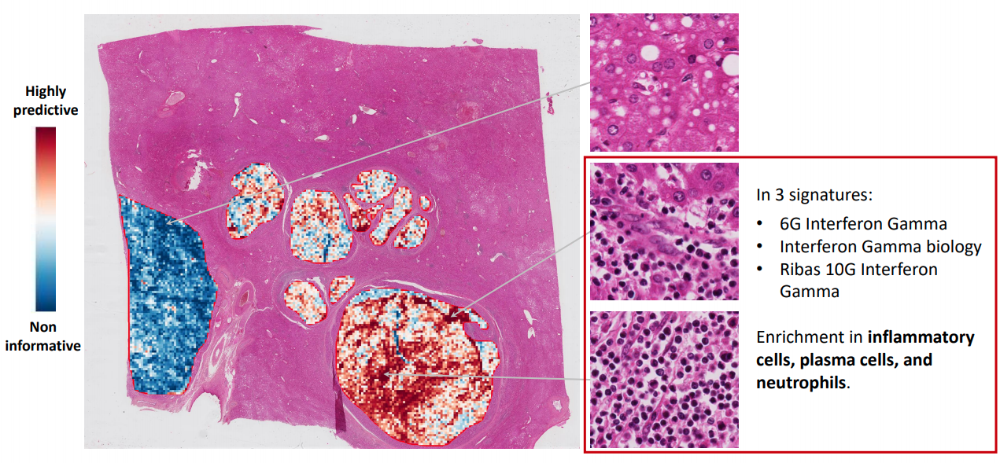
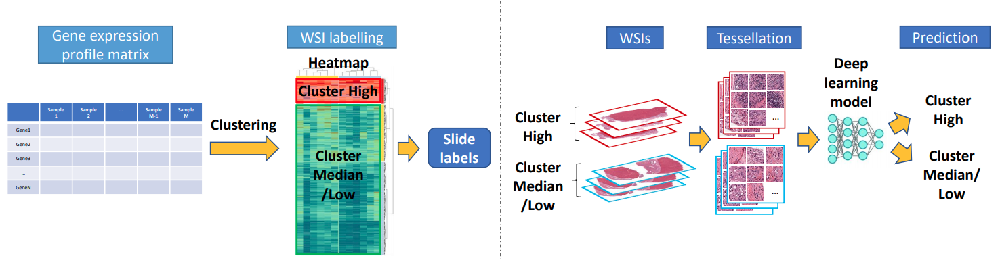

# Predict Immune and Inflammatory Gene Signature Expression Directly from Histology Images 

**Predict 6 gene signatures associated with response to nivolumab and survival in advanced hepatocellular carcinoma (HCC) from [Sangro, Bruno, et al](https://pubmed.ncbi.nlm.nih.gov/32710922/).**
- ***6-Gene Interferon Gamma** ([Ayers, Mark, et al.](https://pubmed.ncbi.nlm.nih.gov/28650338/))* 
- ***Gajewski 13-Gene Inflammatory** ([Spranger, Stefani, Riyue Bao, and Thomas F. Gajewski](https://pubmed.ncbi.nlm.nih.gov/25970248/))*
- ***Inflammatory** ([Sangro, Bruno, et al](https://pubmed.ncbi.nlm.nih.gov/32710922/))* 
- ***Interferon Gamma Biology** ([Ayers, Mark, et al.](https://pubmed.ncbi.nlm.nih.gov/28650338/))* 
- ***Ribas 10-Gene Interferon Gamma** ([Ayers, Mark, et al.](https://pubmed.ncbi.nlm.nih.gov/28650338/))* 
- ***T-cell Exhaustion** ([Ayers, Mark, et al.](https://pubmed.ncbi.nlm.nih.gov/28650338/))* 

Hierarchical clustering was performed on the gene expression data to generate labels for Whole Slide Images (WSIs). The deep learning models were trained (60%) with 10-fold Monte-carlo cross validation (20%) and tested (20%) on the [TCGA LIHC dataset](https://portal.gdc.cancer.gov/projects/TCGA-LIHC). Our in-house dataset (from APHP Henri Mondor) was then used for external validation. Results using tumoral annotations (regions of interest drawn by our expert pathologist)  are superior to those using all the tissue regions.

Of note, the discovery series was stained with hematein-eosin (H&E) while external validation series was stained with hematein-eosin-saffron (HES). Thus we tested stain unmixing (3 methods implemented: Macenko PCA or XU SNMF or a fixed HES vector) and saffron removal for external validation series. Color noralization (2 methods: Reinhard or Macenco PCA) was also tested for both discovery and validation series. Furthermore, on-the-fly basic geometric augmentation were also tested during the training.

**3 Deep learning approaches:**
- *Patch-based* ([original repo](https://github.com/jnkather/DeepHistology))
- *2 Multiple Instance Learning (MIL): CLAM and classic MIL* ([original repo](https://github.com/mahmoodlab/CLAM))

Results
===========
**AUROC in the discovery series (TCGA-LIHC) with/without tumoral annotations:**

<table  align="center">
	<tbody>
		<tr>
			<td align="center" valign="center" rowspan="2"><b>Gene signature</td>
			<td align="center" valign="center" rowspan="2"><b>tumor annot</td>
			<td align="center" valign="center" colspan="2"><b>Patch-based</td>
			<td align="center" valign="center" colspan="2"><b>Classic MIL</td>
			<td align="center" valign="center" colspan="2"><b>CLAM</td>
		</tr>
		<tr>
			<td align="center" valign="center"><b>Best fold</td>
			<td align="center" valign="center"><b>Mean ± sd</td>
			<td align="center" valign="center"><b>Best fold</td>
			<td align="center" valign="center"><b>Mean ± sd</td>
			<td align="center" valign="center"><b>Best fold</td>
			<td align="center" valign="center"><b>Mean ± sd</td>
		</tr>
		<tr>
			<td align="center" valign="center" rowspan="2"><b>6G Interferon Gamma</td>
			<td align="center" valign="center">:x:</td>
			<td align="center" valign="center">0.578</td>
			<td align="center" valign="center">0.492 ± 0.065</td>
			<td align="center" valign="center">0.690</td>
			<td align="center" valign="center">0.576 ± 0.102</td>
			<td align="center" valign="center">0.734</td>
			<td align="center" valign="center">0.600 ± 0.080</td>
		</tr>
		<tr>
			<td align="center" valign="center">:heavy_check_mark:</td>	
			<td align="center" valign="center">0.661</td>
			<td align="center" valign="center">0.560 ± 0.067</td>
			<td align="center" valign="center">0.758</td>
			<td align="center" valign="center">0.630 ± 0.078</td>
			<td align="center" valign="center">0.780</td>
			<td align="center" valign="center">0.635 ± 0.097</td>
		</tr>
		<tr>
			<td align="center" valign="center" rowspan="2"><b>Gajewski 13G Inflammatory</td>
			<td align="center" valign="center">:x:</td>
			<td align="center" valign="center"><b>0.780</td>
			<td align="center" valign="center"><b>0.666 ± 0.072</td>
			<td align="center" valign="center"><b>0.851</td>
			<td align="center" valign="center"><b>0.577 ± 0.179</td>
			<td align="center" valign="center"><b>0.824</td>
			<td align="center" valign="center"><b>0.632 ± 0.107</td>
		</tr>
		<tr>
			<td align="center" valign="center">:heavy_check_mark:</td>	
			<td align="center" valign="center"><b>0.809</td>
			<td align="center" valign="center"><b>0.688 ± 0.062</td>
			<td align="center" valign="center"><b>0.893</td>
			<td align="center" valign="center"><b>0.694 ± 0.125</td>
			<td align="center" valign="center"><b>0.914</td>
			<td align="center" valign="center"><b>0.728 ± 0.096</td>
		</tr>
		<tr>
			<td align="center" valign="center" rowspan="2"><b>Inflammatory</td>
			<td align="center" valign="center">:x:</td>
			<td align="center" valign="center">0.673</td>
			<td align="center" valign="center">0.523 ± 0.079</td>
			<td align="center" valign="center">0.717</td>
			<td align="center" valign="center">0.539 ± 0.139</td>
			<td align="center" valign="center">0.738</td>
			<td align="center" valign="center">0.607 ± 0.090</td>
		</tr>
		<tr>
			<td align="center" valign="center">:heavy_check_mark:</td>	
			<td align="center" valign="center">0.706</td>
			<td align="center" valign="center">0.580 ± 0.077</td>
			<td align="center" valign="center">0.806</td>
			<td align="center" valign="center">0.641 ± 0.123</td>
			<td align="center" valign="center">0.796</td>
			<td align="center" valign="center">0.665 ± 0.081</td>
		</tr>
		<tr>
			<td align="center" valign="center" rowspan="2"><b>Interferon Gamma biology</td>
			<td align="center" valign="center">:x:</td>
			<td align="center" valign="center">0.700</td>
			<td align="center" valign="center">0.541 ± 0.088</td>
			<td align="center" valign="center">0.672</td>
			<td align="center" valign="center">0.562 ± 0.117</td>
			<td align="center" valign="center">0.759</td>
			<td align="center" valign="center">0.622 ± 0.088</td>
		</tr>
		<tr>
			<td align="center" valign="center">:heavy_check_mark:</td>	
			<td align="center" valign="center">0.783</td>
			<td align="center" valign="center">0.561 ± 0.119</td>
			<td align="center" valign="center">0.677</td>
			<td align="center" valign="center">0.610 ± 0.051</td>
			<td align="center" valign="center">0.822</td>
			<td align="center" valign="center">0.674 ± 0.102</td>
		</tr>
		<tr>
			<td align="center" valign="center" rowspan="2"><b>Ribas 10G Inflammatory</td>
			<td align="center" valign="center">:x:</td>
			<td align="center" valign="center">0.672</td>
			<td align="center" valign="center">0.583 ± 0.081</td>
			<td align="center" valign="center">0.652</td>
			<td align="center" valign="center">0.552 ± 0.083</td>
			<td align="center" valign="center">0.758</td>
			<td align="center" valign="center">0.627 ± 0.082</td>
		</tr>
		<tr>
			<td align="center" valign="center">:heavy_check_mark:</td>	
			<td align="center" valign="center">0.727</td>
			<td align="center" valign="center">0.640 ± 0.074</td>
			<td align="center" valign="center">0.726</td>
			<td align="center" valign="center">0.618 ± 0.065</td>
			<td align="center" valign="center">0.806</td>
			<td align="center" valign="center">0.669 ± 0.067</td>
		</tr>
		<tr>
			<td align="center" valign="center" rowspan="2"><b>T cell exhaustion</td>
			<td align="center" valign="center">:x:</td>
			<td align="center" valign="center">0.661</td>
			<td align="center" valign="center">0.490 ± 0.108</td>
			<td align="center" valign="center">0.744</td>
			<td align="center" valign="center">0.516 ± 0.123</td>
			<td align="center" valign="center">0.627</td>
			<td align="center" valign="center">0.555 ± 0.063</td>
		</tr>
		<tr>
			<td align="center" valign="center">:heavy_check_mark:</td>	
			<td align="center" valign="center">0.661</td>
			<td align="center" valign="center">0.543 ± 0.073</td>
			<td align="center" valign="center">0.788</td>
			<td align="center" valign="center">0.606 ± 0.086</td>
			<td align="center" valign="center">0.788</td>
			<td align="center" valign="center">0.577 ± 0.092</td>
		</tr>
	</tbody>
</table>

**AUROC (of best-fold model) in the external validation series (Mondor) with tumoral anotations:**

<table  align="center">
	<tbody>
		<tr>
			<td align="center" valign="center"><b>Gene signature (with tumor annot :heavy_check_mark:)</td>
			<td align="center" valign="center"><b>Patch-based</td>
			<td align="center" valign="center"><b>Classic MIL</td>
			<td align="center" valign="center"><b>CLAM</td>
		</tr>
		<tr>
			<td align="center" valign="center"><b>6G Interferon Gamma</td>
			<td align="center" valign="center">0.694</td>
			<td align="center" valign="center">0.745</td>
			<td align="center" valign="center">0.871</td>
		</tr>
		<tr>
			<td align="center" valign="center"><b>Gajewski 13G Inflammatory</td>
			<td align="center" valign="center">0.657</td>
			<td align="center" valign="center">0.782</td>
			<td align="center" valign="center">0.810</td>
		</tr>
		<tr>
			<td align="center" valign="center"><b>Inflammatory</td>
			<td align="center" valign="center">0.657</td>
			<td align="center" valign="center">0.816</td>
			<td align="center" valign="center">0.850</td>
		</tr>
		<tr>
			<td align="center" valign="center"><b>Interferon Gamma biology</td>
			<td align="center" valign="center">0.755</td>
			<td align="center" valign="center">0.793</td>
			<td align="center" valign="center">0.823</td>
		</tr>
		<tr>
			<td align="center" valign="center"><b>Ribas 10G Inflammatory</td>
			<td align="center" valign="center">0.605</td>
			<td align="center" valign="center">0.779</td>
			<td align="center" valign="center">0.810</td>
		</tr>
		<tr>
			<td align="center" valign="center"><b>T cell exhaustion</td>
			<td align="center" valign="center"><b>0.810</td>
			<td align="center" valign="center"><b>0.868</td>
			<td align="center" valign="center"><b>0.921</td>
		</tr>
	</tbody>
</table>

**Visualization / exlainability:**

Workflow
===========

## Part 1. Gene expression clustering 
***To generate labels for WSIs***
1. Process TCGA FPKM data with **gene_clust/codes/tcga_fpkm_processing.ipynb**
2. Perform hierarchical clustering with **gene_clust/codes/PlotHeatmapGeneSignature.R** (to reproduce the heatmap). Or using Python with **gene_clust/codes/tcga_fpkm_clustering.ipynb** (to get the same clustering results)

*All TCGA data used and clutering results are provided in **gene_clust/data** and **gene_clust/results**. Due to privacy issues, the data in Mondor series is not provided but commands for external validation are described in this [tutorial](tutorials/external_validation.md).*

## Part 2. Deep learning
***To classify WSIs***

The patch based approach requires another conda environment compared the two MIL approaches. According to the original CLAM repository, there are two options for tessellation, either saving both coordinates and images, or only coordinates to economize storage space (especially for large dataset or multiple modified patch versions) and loading images on-the-fly during the feature extraction (so-called *fp*). Annotations should be coordinates at the highest mangification of the WSI. Simple annotations in *TXT* and hierarchical annotations (for example to exclude necrosis inside a tumor) in *NPT* can be accepted.

1. **Patch based approach**
    - fp
        - Without annotations: [tutorial_patch-based_fp](tutorials/patch-based_fp.md)
        - With annotations: [tutorial_patch-based_fp_anno](tutorials/patch-based_fp_anno.md)
    - not fp
        - Without annotations: [tutorial_patch-based](tutorials/patch-based.md)
        - With annotations: [tutorial_patch-based_anno](tutorials/patch-based_anno.md)
2. **Classic MIL**
    - fp
        - Without annotations: [tutorial_mil_fp](tutorials/mil_fp.md)
        - With annotations: [tutorial_mil_fp_anno](tutorials/mil_fp_anno.md)
    - not fp
        - Without annotations: [tutorial_mil](tutorials/mil.md)
        - With annotations: [tutorial_mil_anno](tutorials/mil_anno.md)
3. **CLAM**
    - fp
        - Without annotations: [tutorial_clam_fp](tutorials/clam_fp.md)
        - With annotations: [tutorial_clam_fp_anno](tutorials/clam_fp_anno.md)
    - not fp
        - Without annotations: [tutorial_clam](tutorials/clam.md)
        - With annotations: [tutorial_clam_anno](tutorials/clam_anno.md)
4. **Other settings**: [tutorial](tutorials/other_settings.md), including stain unmixing (and saffron removal), color normalization or data augmentation.

