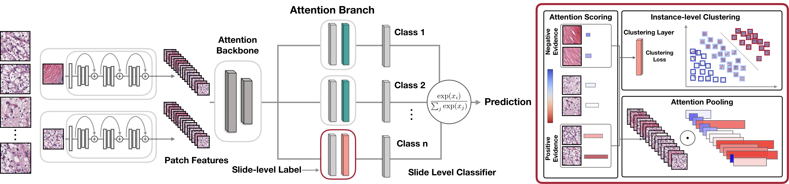
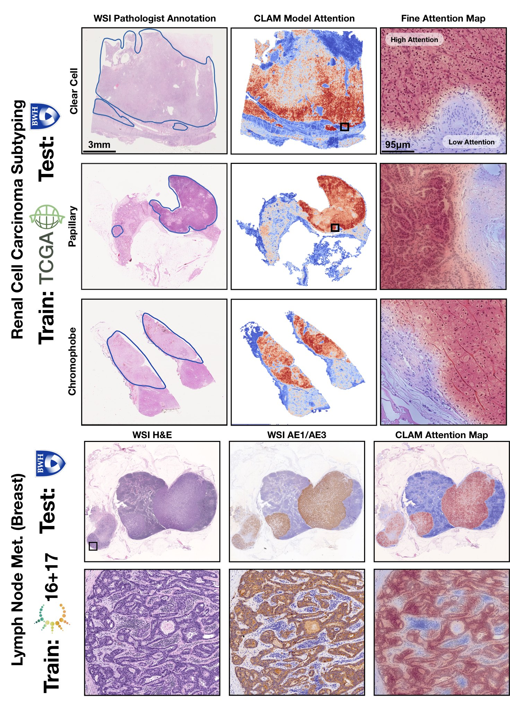

CLAM 
===========
Data Efficient and Weakly Supervised Computational Pathology on Whole Slide Images.
*Nature Biomedical Engineering*

[ArXiv](https://arxiv.org/abs/2004.09666) | [Journal Link](https://www.nature.com/articles/s41551-020-00682-w) | [Interactive Demo](http://clam.mahmoodlab.org) | [Cite](#reference) 

***TL;DR:** CLAM is a high-throughput and interpretable method for data efficient whole slide image (WSI) classification using slide-level labels without any ROI extraction or patch-level annotations, and is capable of handling multi-class subtyping problems. Tested on three different WSI datasets, trained models adapt to independent test cohorts of WSI resections and biopsies as well as smartphone microscopy images (photomicrographs).*

[](http://clam.mahmoodlab.org)
## CLAM: A Deep-Learning-based Pipeline for Data Efficient and Weakly Supervised Whole-Slide-level Analysis 
[Pre-requisites](#pre-requisites) • [Installation](INSTALLATION.md) • [Segmentation and Patching](#wsi-segmentation-and-patching) • [Feature Extraction](#weakly-supervised-learning-using-slide-level-labels-with-clam) • [Weakly Supervised Training](#Training-Splits) • [Testing](#Testing-and-Evaluation-Script) • [Trained Models](#Trained-Model-Checkpoints) • [Heatmap Visualization](#Heatmap-Visualization) • [Examples](#examples) • [Pre-print](https://arxiv.org/abs/2004.09666) • [Demo](http://clam.mahmoodlab.org) • [Cite](#reference)

***How does CLAM work?** Clustering-constrained Attention Multiple Instance Learning (CLAM) is a deep-learning-based weakly-supervised method that uses attention-based learning to automatically identify sub-regions of high diagnostic value in order to accurately classify the whole slide, while also utilizing instance-level clustering over the representative regions identified to constrain and refine the feature space.*

© [Mahmood Lab](http://www.mahmoodlab.org) - This code is made available under the GPLv3 License and is available for non-commercial academic purposes. 

## Updates:
* **04/15/2025**: Checkout our new repository [Trident](https://github.com/mahmoodlab/TRIDENT) for whole-slide image processing with support for 25+ foundation models, including [UNIv2](https://huggingface.co/MahmoodLab/UNI2-h), [CONCH](https://huggingface.co/MahmoodLab/CONCH), [TITAN](https://huggingface.co/MahmoodLab/TITAN), and many more!
* **04/06/2024**: [UNI](https://github.com/mahmoodlab/UNI) and [CONCH](https://github.com/mahmoodlab/CONCH) are now available to select as pretrained encoders. See [Using CONCH / UNI as Pretrained Encoders](#using-conch--uni-as-pretrained-encoders) for more details. Please make sure all dependencies are installed correctly by installing the latest **env.yml** file (see [Installation guide](INSTALLATION.md) for details), and using the corresponding **clam_latest** conda environment.
* 03/19/2024: We are releasing [UNI](https://github.com/mahmoodlab/UNI) and [CONCH](https://github.com/mahmoodlab/CONCH), a pair of SOTA pretrained encoders that produce strong representations for histopathology images and enhance performance on various computational pathology workflows, including the MIL-based CLAM workflow. 
* 05/24/2021: Script for heatmap visualization now available via **create_heatmaps.py**, with the configuration template located in **heatmaps/configs**. See [Heatmap visualization for demo and instructions.](#Heatmap-Visualization)
* 03/01/2021: New, fast patching/feature extraction pipeline is now available. 
更新日志：
2025 年 4 月 15 日：欢迎查看我们的新代码仓库 Trident，该仓库适用于全切片图像处理，支持 25 种以上的基础模型，包括 UNIv2、CONCH、TITAN 等！
2024 年 4 月 6 日：UNI 和 CONCH 现已可选择作为预训练编码器。更多详情请参见《将 CONCH/UNI 用作预训练编码器》（Using CONCH / UNI as Pretrained Encoders）部分。请务必通过安装最新的 env.yml 文件（详情参见《安装指南》Installation guide）并使用对应的 clam_latest conda 环境，确保所有依赖项均已正确安装。
2024 年 3 月 19 日：我们发布了 UNI 和 CONCH—— 这是一对性能最优（SOTA，State-of-the-Art）的预训练编码器，能为组织病理学图像生成高质量特征表示，并提升各类计算病理工作流程的性能，包括基于多实例学习（MIL，Multiple Instance Learning）的 CLAM 工作流程。
2021 年 5 月 24 日：现已提供热力图可视化脚本，可通过 create_heatmaps.py 调用，配置模板位于 heatmaps/configs 目录下。演示及操作说明请参见《热力图可视化》（Heatmap Visualization）部分。
2021 年 3 月 1 日：全新的快速切片 / 特征提取流水线现已上线。
**TL;DR:** since CLAM only requires image features for training, it is not necessary to save the actual image patches, the new pipeline rids of this overhead and instead only saves the coordinates of image patches during "patching" and loads these regions on the fly from WSIs during feature extraction. This is significantly faster than the old pipeline and usually only takes 1-2s for "patching" and a couple minutes to featurize a WSI. To use the new pipeline, make sure you are calling **create_patches_fp.py** and **extract_features_fp.py** instead of the old **create_patches.py** and **extract_features.py** scripts.
核心摘要（TL;DR，Too Long; Didn't Read）：由于 CLAM 模型训练仅需图像特征，无需保存实际图像切片；新流水线去除了这一冗余步骤，在 “切片” 过程中仅保存图像切片的坐标，并在特征提取时从全切片图像（WSI）中实时加载这些区域。该流水线比旧版本速度显著提升，“切片” 过程通常仅需 1-2 秒，全切片图像特征提取也仅需几分钟。若要使用新流水线，请确保调用 create_patches_fp.py 和 extract_features_fp.py 脚本，而非旧版本的 create_patches.py 和 extract_features.py。

**Note**: while we hope that the newest update will require minimal changes to the user's workflow, if needed, you may reference the old version of the code base [here](https://github.com/mahmoodlab/CLAM/tree/deprecated). Please report any issues in the public forum. 
注意：我们希望最新更新对用户的工作流程改动最小，但如需参考旧版本代码库，可访问此链接（here）。如有任何问题，请在公共论坛中反馈。

**Warning**: the latest update will by default resize image patches to 224 x 224 before extracting features using the pretrained encoder. This change serves to make it more consistent with the evaluation protocol used in UNI, CONCH and other studies. If you wish to preserve the original size of the image patches generated during patching or use a different image size for feature extraction, you can do so by specifying `--target_patch_size` in **extract_features_fp.py**.
警告：最新更新默认会在使用预训练编码器提取特征前，将图像切片（image patches）调整为 224×224 的尺寸。此改动旨在与 UNI、CONCH 及其他研究中采用的评估协议保持一致。若你希望保留 “切片生成”（patching）过程中产生的图像切片原始尺寸，或使用其他尺寸进行特征提取，可在extract_features_fp.py脚本中通过指定--target_patch_size参数实现。

**RE update 03/01/21**: note that the README has been updated to use the new, faster pipeline by default. If you still wish to use the old pipeline, refer to: [Guide for Old Pipeline](README_old.md). It saves tissue patches, which is signficantly slower and takes up a lot of storage space but can still be useful if you need to work with original image patches instead of feature embeddings.
关于 2021 年 3 月 1 日更新的补充说明：请注意，本 README 文档已更新，默认采用全新的快速处理流水线（pipeline）。若你仍需使用旧流水线，请参考《旧流水线使用指南》（Guide for Old Pipeline）。旧流水线会保存组织切片（tissue patches），其速度显著较慢且占用大量存储空间，但当你需要使用原始图像切片而非特征嵌入（feature embeddings）时，该流水线仍具备实用价值。

## Installation:
Please refer to our [Installation guide](INSTALLATION.md) for detailed instructions on how to get started.
安装说明
如需详细的入门操作指南，请参考我们的《安装指南》（Installation guide）。

## WSI Segmentation and Patching 
全切片图像（WSI）分割与切片处理


The first step focuses on segmenting the tissue and excluding any holes. The segmentation of specific slides can be adjusted by tuning the individual parameters (e.g. dilated vessels appearing as holes may be important for certain sarcomas.) 
The following example assumes that digitized whole slide image data in well known standard formats (.svs, .ndpi, .tiff etc.) are stored under a folder named DATA_DIRECTORY
第一步的核心是对组织区域进行分割，并排除所有孔洞区域。对于特定切片的分割效果，可通过调整各项参数进行优化（例如，在某些肉瘤的分析场景中，表现为孔洞的扩张血管可能是重要的分析对象，需特殊调整参数）。
以下示例假设数字化的全切片图像数据（采用常见标准格式，如.svs、.ndpi、.tiff 等）均存储在名为 “DATA_DIRECTORY” 的文件夹下，文件夹结构如下：

```bash
DATA_DIRECTORY/
	├── slide_1.svs
	├── slide_2.svs
	└── ...
```

### Basic, Fully Automated Run
基础全自动运行方式
``` shell
python create_patches_fp.py --source DATA_DIRECTORY --save_dir RESULTS_DIRECTORY --patch_size 256 --seg --patch --stitch 
```

The above command will segment every slide in DATA_DIRECTORY using default parameters, extract all patches within the segemnted tissue regions, create a stitched reconstruction for each slide using its extracted patches (optional) and generate the following folder structure at the specified RESULTS_DIRECTORY:
上述命令将使用默认参数对 “DATA_DIRECTORY” 文件夹中的所有切片进行分割，提取分割后组织区域内的所有切片块（patch），并使用提取的切片块为每个切片创建拼接重建图像（此步骤为可选），最终在指定的 “RESULTS_DIRECTORY” 文件夹下生成如下目录结构：

```bash
RESULTS_DIRECTORY/
	├── masks
    		├── slide_1.png
    		├── slide_2.png
    		└── ...
	├── patches
    		├── slide_1.h5
    		├── slide_2.h5
    		└── ...
	├── stitches
    		├── slide_1.png
    		├── slide_2.png
    		└── ...
	└── process_list_autogen.csv
```

The **masks** folder contains the segmentation results (one image per slide).
masks（掩码）文件夹：包含所有切片的分割结果（每个切片对应 1 张分割结果图像）。
（注：此处的 “掩码” 是图像分割领域的常用概念，指通过像素标记区分组织区域与背景 / 孔洞区域的图像，可用于后续精准提取组织切片块。）
The **patches** folder contains arrays of extracted tissue patches from each slide (one .h5 file per slide, where each entry corresponds to the coordinates of the top-left corner of a patch)
patches（切片块）文件夹：包含从每张切片中提取的组织切片块数组（每个切片对应 1 个.h5 文件，文件中每条数据记录均对应 1 个切片块左上角的坐标信息）。
（注：.h5 是一种高效存储海量数值数据的文件格式，此处仅存储切片块坐标而非原始图像数据，可大幅节省存储空间并提升后续特征提取的效率。）
The **stitches** folder contains downsampled visualizations of stitched tissue patches (one image per slide) (Optional, not used for downstream tasks)
stitches（拼接图）文件夹：包含组织切片块的下采样拼接可视化图像（每个切片对应 1 张拼接图）（此为可选输出，不用于后续下游任务）。
（注：“下采样” 指降低图像分辨率以减少数据量，便于快速查看整体组织分布；该文件夹内容仅用于人工直观验证切片块提取效果，不参与模型训练或分析计算。）
The auto-generated csv file **process_list_autogen.csv** contains a list of all slides processed, along with their segmentation/patching parameters used.
自动生成的 CSV 文件process_list_autogen.csv：包含所有已处理切片的列表，以及处理每张切片时所用的分割 / 切片块提取参数。
（注：CSV 文件可直接用 Excel 或代码打开，便于用户追溯每张切片的处理配置，也可用于批量管理或复现实验流程。）

Additional flags that can be passed include:
* `--custom_downsample`: factor for custom downscale (not recommended, ideally should first check if native downsamples exist)
* `--patch_level`: which downsample pyramid level to extract patches from (default is 0, the highest available resolution)
* `--no_auto_skip`: by default, the script will skip over files for which patched .h5 files already exist in the desination folder, this toggle can be used to override this behavior
可额外传入的参数（flags）包括：
--custom_downsample：自定义下采样系数（不推荐使用，理想情况下应先检查是否存在原生下采样层级）。（注：“下采样” 指降低图像分辨率以减少数据量；“原生下采样层级” 是全切片图像（WSI）生成时默认保存的不同分辨率版本，直接使用原生层级可避免自定义下采样可能导致的图像信息失真或处理效率下降。）
--patch_level：指定从哪个下采样金字塔层级提取切片块（默认值为 0，即最高可用分辨率层级）。（注：全切片图像通常以 “金字塔层级” 形式存储，层级 0 对应原始扫描的最高分辨率，层级数值越大，分辨率越低；该参数可根据后续任务对分辨率的需求灵活选择，例如低分辨率层级适用于快速预览，高分辨率层级适用于精细特征提取。）
--no_auto_skip：默认情况下，若目标文件夹中已存在某文件对应的切片块.h5 文件，脚本会自动跳过该文件的处理；启用此参数可覆盖该默认行为（即强制重新处理已存在.h5 文件的切片）。（注：该参数适用于需要更新切片块数据的场景，例如修改了分割参数后需重新生成切片块，但需注意会覆盖原有文件，且可能增加重复计算的时间成本。）

Some parameter templates are also availble and can be readily deployed as good choices for default parameters:
* `bwh_biopsy.csv`: used for segmenting biopsy slides scanned at BWH (Scanned using Hamamatsu S210 and Aperio GT450) 
* `bwh_resection.csv`: used for segmenting resection slides scanned at BWH
* `tcga.csv`: used for segmenting TCGA slides
目前提供了部分参数模板，这些模板可作为默认参数的优质选择直接使用：
bwh_biopsy.csv：适用于分割在布列根和妇女医院（BWH，Brigham and Women's Hospital）扫描的活检切片（使用滨松（Hamamatsu）S210 和阿佩里奥（Aperio）GT450 扫描仪扫描）。
bwh_resection.csv：适用于分割在布列根和妇女医院扫描的切除标本切片。
tcga.csv：适用于分割 TCGA（癌症基因组图谱，The Cancer Genome Atlas）切片。

Simply pass the name of the template file to the --preset argument, for example, to use the biopsy template:
只需将模板文件名传入--preset参数即可调用，例如，若要使用活检切片模板，命令如下：
``` shell
python create_patches_fp.py --source DATA_DIRECTORY --save_dir RESULTS_DIRECTORY --patch_size 256 --preset bwh_biopsy.csv --seg --patch --stitch
```
### Custom Default Segmentation Parameters

For advanced usage, in addition to using the default, single set of parameters defined in the script **create_patches_fp.py**, the user can define custom templates of parameters depending on the dataset. These templates are expected to be stored under **presets**, and contain values for each of the parameters used during segmentation and patching. 

The list of segmentation parameters is as follows:
* `seg_level`: downsample level on which to segment the WSI (default: -1, which uses the downsample in the WSI closest to 64x downsample)
* `sthresh`: segmentation threshold (positive integer, default: 8, using a higher threshold leads to less foreground and more background detection)
* `mthresh`: median filter size (positive, odd integer, default: 7)
* `use_otsu`: use otsu's method instead of simple binary thresholding (default: False) 
* `close`: additional morphological closing to apply following initial thresholding (positive integer or -1, default: 4)

The list of contour filtering parameters is as follows:
* `a_t`: area filter threshold for tissue (positive integer, the minimum size of detected foreground contours to consider, relative to a reference patch size of 512 x 512 at level 0, e.g. a value 10 means only detected foreground contours of size greater than 10 512 x 512 sized patches at level 0 will be processed, default: 100)
* `a_h`: area filter threshold for holes (positive integer, the minimum size of detected holes/cavities in foreground contours to avoid, once again relative to 512 x 512 sized patches at level 0, default: 16)
* `max_n_holes`: maximum of holes to consider per detected foreground contours (positive integer, default: 10, higher maximum leads to more accurate patching but increases computational cost)

The list of segmentation visualization parameters is as follows:
* `vis_level`: downsample level to visualize the segmentation results (default: -1, which uses the downsample in the WSI closest to 64x downsample)
* `line_thickness`: line thickness to draw visualize the segmentation results (positive integer, in terms of number of pixels occupied by drawn line at level 0, default: 250)

The list of patching parameters is as follows:
* `use_padding`: whether to pad the border of the slide (default: True)
* `contour_fn`: contour checking function to decide whether a patch should be considered foreground or background (choices between 'four_pt' - checks if all four points in a small, grid around the center of the patch are inside the contour, 'center' - checks if the center of the patch is inside the contour, 'basic' - checks if the top-left corner of the patch is inside the contour, default: 'four_pt')


### Two-Step Run (Mannually Adjust Parameters For Specific Slides)
To ensure that high quality segmentation and extraction of relevant tissue patches, user has the option of first performing segmentation (typically around 1s per slide), inspecting the segmentation results and tweaking the parameters for select slides if necessary and then extracting patches using the tweaked parameters. i.e., first run:

``` shell
python create_patches_fp.py --source DATA_DIRECTORY --save_dir RESULTS_DIRECTORY --patch_size 256 --seg  
```
The above command will segment every slide in DATA_DIRECTORY using default parameters and generate the csv file, but will NOT patch just yet (**patches** and **stitches** folders will be empty)

The csv file can be tweaked for specific slides, and be passed to the script via the --process_list CSV_FILE_NAME such that the script will use the user-updated specifications. Before tweaking the segmentation parameters, the user should make a copy of the csv file and give it a new name (e.g. process_list_edited.csv) because otherwise this file with the default name is overwritten the next time the command is run. Then the user has the option to tweak the parameters for specific slides by changing their corresponding fields in the csv file. The **process** column stores a binary variable (0 or 1) for whether the script should process a specific slide. This allows the user to toggle on just the select few slides to quickly confirm whether the tweaked parameters produce satisfactory results. For example, to re-segment just slide_1.svs again using user-updated parameters, make the appropriate changes to its fields, update its **process** cell to 1, save the csv file, and pass its name to the same command as above:

``` shell
python create_patches_fp.py --source DATA_DIRECTORY --save_dir RESULTS_DIRECTORY --patch_size 256 --seg --process_list process_list_edited.csv
```

When satisfied with the segmentation results, the user should make the **process** cell for all slides that need to be processed to 1, save the csv file, and run patching with the saved csv file (just like in the fully-automated run use case, with the additional csv file argument):

``` shell
python create_patches_fp.py --source DATA_DIRECTORY --save_dir RESULTS_DIRECTORY --patch_size 256 --seg --process_list CSV_FILE_NAME --patch --stitch
```
## Weakly-Supervised Learning using Slide-Level Labels with CLAM



### Feature Extraction (GPU Example)
```bash
CUDA_VISIBLE_DEVICES=0 python extract_features_fp.py --data_h5_dir DIR_TO_COORDS --data_slide_dir DATA_DIRECTORY --csv_path CSV_FILE_NAME --feat_dir FEATURES_DIRECTORY --batch_size 512 --slide_ext .svs
```
The above command expects the coordinates .h5 files to be stored under DIR_TO_COORDS and a batch size of 512 to extract 1024-dim features from each tissue patch for each slide and produce the following folder structure:
```bash
FEATURES_DIRECTORY/
    ├── h5_files
            ├── slide_1.h5
            ├── slide_2.h5
            └── ...
    └── pt_files
            ├── slide_1.pt
            ├── slide_2.pt
            └── ...
```
where each .h5 file contains an array of extracted features along with their patch coordinates (note for faster training, a .pt file for each slide is also created for each slide, containing just the patch features). The csv file is expected to contain a list of slide filenames (without the filename extensions) to process (the easiest option is to take the csv file auto generated by the previous segmentation/patching step, and delete the filename extensions)

### Using CONCH / UNI as Pretrained Encoders
If using UNI or CONCH, first refer to their respective HF page below to request and download the model weights (pytorch_model.bin). 

UNI: https://huggingface.co/MahmoodLab/UNI

CONCH: https://huggingface.co/MahmoodLab/CONCH

After successfully downloading the model checkpoints, you need to set the `CONCH_CKPT_PATH` and `UNI_CKPT_PATH` environment variable to the path of the pretrained encoder checkpoints, before running the feature extraction script. For example, if you have downloaded the pretrained UNI and CONCH checkpoints and placed them in the **checkpoints/conch** and **checkpoints/uni** folders respectively, you can set the environment variables as follows:
```bash
export CONCH_CKPT_PATH=checkpoints/conch/pytorch_model.bin
export UNI_CKPT_PATH=checkpoints/uni/pytorch_model.bin
```
When running the **extract_features_fp.py** also set `--model_name` to either 'uni_v1' or 'conch_v1' to use the respective encoder.

Note that these encoder models (especially UNI, which uses ViT-L) are more computationally expensive and require more GPU memory than the default ResNet50 encoder, so expect longer runtimes and reduced batch sizes accordingly if you run out of GPU memory. UNI will produce 1024-dim features, while CONCH will produce 512-dim features.

### Datasets
The data used for training and testing are expected to be organized as follows:
```bash
DATA_ROOT_DIR/
    ├──DATASET_1_DATA_DIR/
        ├── h5_files
                ├── slide_1.h5
                ├── slide_2.h5
                └── ...
        └── pt_files
                ├── slide_1.pt
                ├── slide_2.pt
                └── ...
    ├──DATASET_2_DATA_DIR/
        ├── h5_files
                ├── slide_a.h5
                ├── slide_b.h5
                └── ...
        └── pt_files
                ├── slide_a.pt
                ├── slide_b.pt
                └── ...
    └──DATASET_3_DATA_DIR/
        ├── h5_files
                ├── slide_i.h5
                ├── slide_ii.h5
                └── ...
        └── pt_files
                ├── slide_i.pt
                ├── slide_ii.pt
                └── ...
    └── ...
```
Namely, each dataset is expected to be a subfolder (e.g. DATASET_1_DATA_DIR) under DATA_ROOT_DIR, and the features extracted for each slide in the dataset is stored as a .pt file sitting under the **pt_files** folder of this subfolder.
Datasets are also expected to be prepared in a csv format containing at least 3 columns: **case_id**, **slide_id**, and 1 or more labels columns for the slide-level labels. Each **case_id** is a unique identifier for a patient, while the **slide_id** is a unique identifier for a slide that correspond to the name of an extracted feature .pt file. This is necessary because often one patient has multiple slides, which might also have different labels. When train/val/test splits are created, we also make sure that slides from the same patient do not go to different splits. The slide ids should be consistent with what was used during the feature extraction step. We provide 2 dummy examples of such dataset csv files in the **dataset_csv** folder: one for binary tumor vs. normal classification (task 1) and one for multi-class tumor_subtyping (task 2). 

Dataset objects used for actual training/validation/testing can be constructed using the **Generic_MIL_Dataset** Class (defined in **datasets/dataset_generic.py**). Examples of such dataset objects passed to the models can be found in both **main.py** and **eval.py**. 

For training, look under main.py:
```python 
if args.task == 'task_1_tumor_vs_normal':
    args.n_classes=2
    dataset = Generic_MIL_Dataset(csv_path = 'dataset_csv/tumor_vs_normal_dummy_clean.csv',
                            data_dir= os.path.join(args.data_root_dir, 'tumor_vs_normal_feat_resnet'),
                            shuffle = False, 
                            seed = args.seed, 
                            print_info = True,
                            label_dict = {'normal_tissue':0, 'tumor_tissue':1},
                            label_col = 'label',
                            ignore=[])
```
The user would need to pass:
* csv_path: the path to the dataset csv file
* data_dir: the path to saved .pt features
* label_dict: a dictionary that maps labels in the label column to numerical values
* label_col: name of the label column (optional, by default it's 'label')
* ignore: labels to ignore (optional, by default it's an empty list)

Finally, the user should add this specific 'task' specified by this dataset object in the --task arguments as shown below:

```python
parser.add_argument('--task', type=str, choices=['task_1_tumor_vs_normal',  'task_2_tumor_subtyping'])
```

### Training Splits
For evaluating the algorithm's performance, multiple folds (e.g. 10-fold) of train/val/test splits can be used. Example 10-fold 80/10/10 splits for the two dummy datasets can be found under the **splits** folder. These splits can be automatically generated using the create_splits_seq.py script with minimal modification just like with **main.py**. For example, tumor_vs_normal splits can be created by calling:
 
``` shell
python create_splits_seq.py --task task_1_tumor_vs_normal --seed 1 --k 10
```
The script uses the **Generic_WSI_Classification_Dataset** Class for which the constructor expects the same arguments as 
**Generic_MIL_Dataset** (without the data_dir argument). For details, please refer to the dataset definition in **datasets/dataset_generic.py**

### GPU Training Example for Binary Positive vs. Negative Classification (e.g. Lymph Node Status)
Note: --embed_dim should be set to 512 for CONCH, and 1024 for UNI and resnet50_trunc.

``` shell
CUDA_VISIBLE_DEVICES=0 python main.py --drop_out 0.25 --early_stopping --lr 2e-4 --k 10 --exp_code task_1_tumor_vs_normal_CLAM_50 --weighted_sample --bag_loss ce --inst_loss svm --task task_1_tumor_vs_normal --model_type clam_sb --log_data --data_root_dir DATA_ROOT_DIR --embed_dim 1024
```

### GPU Training Example for Subtyping Problems (e.g. 3-class RCC Subtyping)
``` shell
CUDA_VISIBLE_DEVICES=0 python main.py --drop_out 0.25 --early_stopping --lr 2e-4 --k 10 --exp_code task_2_tumor_subtyping_CLAM_50 --weighted_sample --bag_loss ce --inst_loss svm --task task_2_tumor_subtyping --model_type clam_sb --log_data --subtyping --data_root_dir DATA_ROOT_DIR --embed_dim 1024
``` 
Note: We have included the option to use a single-attention-branch CLAM model, which performs favoribly in most experiments and can be set via --model_type clam_sb (single branch) or clam_mb (multi branch). clam_sb is the default choice. Additionally, the user can adjust the number of patches used for clustering via --B.

By default results will be saved to **results/exp_code** corresponding to the exp_code input argument from the user. If tensorboard logging is enabled (with the arugment toggle --log_data), the user can go into the results folder for the particular experiment, run:
``` shell
tensorboard --logdir=.
```
This should open a browser window and show the logged training/validation statistics in real time. 
For information on each argument, see:
``` shell
python main.py -h
```

### Testing and Evaluation Script
User also has the option of using the evluation script to test the performances of trained models. Examples corresponding to the models trained above are provided below:
``` shell
CUDA_VISIBLE_DEVICES=0 python eval.py --k 10 --models_exp_code task_1_tumor_vs_normal_CLAM_50_s1 --save_exp_code task_1_tumor_vs_normal_CLAM_50_s1_cv --task task_1_tumor_vs_normal --model_type clam_sb --results_dir results --data_root_dir DATA_ROOT_DIR --embed_dim 1024
```

``` shell
CUDA_VISIBLE_DEVICES=0 python eval.py --k 10 --models_exp_code task_2_tumor_subtyping_CLAM_50_s1 --save_exp_code task_2_tumor_subtyping_CLAM_50_s1_cv --task task_2_tumor_subtyping --model_type clam_sb --results_dir results --data_root_dir DATA_ROOT_DIR --embed_dim 1024
```


Once again, for information on each commandline argument, see:
``` shell
python eval.py -h
```

By adding your own custom datasets into **eval.py** the same way as you do for **main.py**, you can also easily test trained models on independent test sets. 

### Heatmap Visualization
Heatmap visualization can be computed in bulk via **create_heatmaps.py** by filling out the config file and storing it in **/heatmaps/configs** and then running **create_heatmaps.py** with the --config NAME_OF_CONFIG_FILE flag. A demo template is included (**config_template.yaml**) for lung subtyping on two WSIs from the CPTAC. 
To run the demo (raw results are saved in **heatmaps/heatmap_raw_results** and final results are saved in **heatmaps/heatmap_production_results**):
``` shell
CUDA_VISIBLE_DEVICES=0 python create_heatmaps.py --config config_template.yaml
```
See **/heatmaps/configs/config_template.yaml** for explanations for each configurable option.

Similar to feature extraction, if using UNI / CONCH, set the environment variables before running the script. See [Using CONCH / UNI as Pretrained Encoders](#using-conch--uni-as-pretrained-encoders) for more details.


### Trained Model Checkpoints
For reproducability, all trained models used can be accessed [here](https://drive.google.com/drive/folders/1NZ82z0U_cexP6zkx1mRk-QeJyKWk4Q7z?usp=sharing).
The 3 main folders (**tcga_kidney_cv**, **tcga_cptac_lung_cv** and **camelyon_40x_cv**) correspond to models for RCC subtyping trained on the TCGA, for NSCLC subtyping trained on TCGA and CPTAC and for Lymph Node Metastasis (Breast) detection trained on Camelyon16+17 respectively. In each main folder, each subfolder corresponds to one set of 10-fold cross-validation experiments. For example, the subfolder tcga_kidney_cv_CLAM_50_s1 contains the 10 checkpoints corresponding to the 10 cross-validation folds for TCGA RCC subtyping, trained using CLAM with multi-attention branches using 50% of cases in the full training set. 

For reproducability, these models can be evaluated on data prepared by following the same pipeline described in the sections above by calling **eval.py** with the appropriate arguments that specify the model options (either --model_type clam_mb or --model_type mil should be set, for evaluation only, --subtyping flag does not make a difference) as well as where the model checkpoints (--results_dir and --models_exp_code) and data (--data_root_dir and --task) are stored.

### Examples

Please refer to our pre-print and [interactive demo](http://clam.mahmoodlab.org) for detailed results on three different problems and adaptability across data sources, imaging devices and tissue content. 

  

Visulize additional examples here: http://clam.mahmoodlab.org

## Issues
- Please report all issues on the public forum.

## License
© [Mahmood Lab](http://www.mahmoodlab.org) - This code is made available under the GPLv3 License and is available for non-commercial academic purposes.

## Funding
This work was funded by NIH NIGMS [R35GM138216](https://reporter.nih.gov/search/sWDcU5IfAUCabqoThQ26GQ/project-details/10029418).

## Reference
If you find our work useful in your research or if you use parts of this code please consider citing our [paper](https://www.nature.com/articles/s41551-020-00682-w):

Lu, M.Y., Williamson, D.F.K., Chen, T.Y. et al. Data-efficient and weakly supervised computational pathology on whole-slide images. Nat Biomed Eng 5, 555–570 (2021). https://doi.org/10.1038/s41551-020-00682-w

```
@article{lu2021data,
  title={Data-efficient and weakly supervised computational pathology on whole-slide images},
  author={Lu, Ming Y and Williamson, Drew FK and Chen, Tiffany Y and Chen, Richard J and Barbieri, Matteo and Mahmood, Faisal},
  journal={Nature Biomedical Engineering},
  volume={5},
  number={6},
  pages={555--570},
  year={2021},
  publisher={Nature Publishing Group}
}
```
