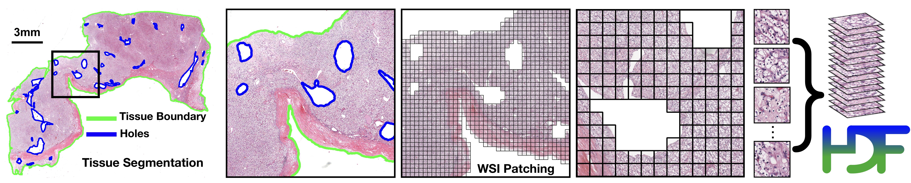
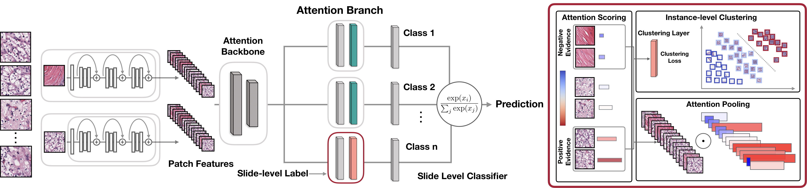
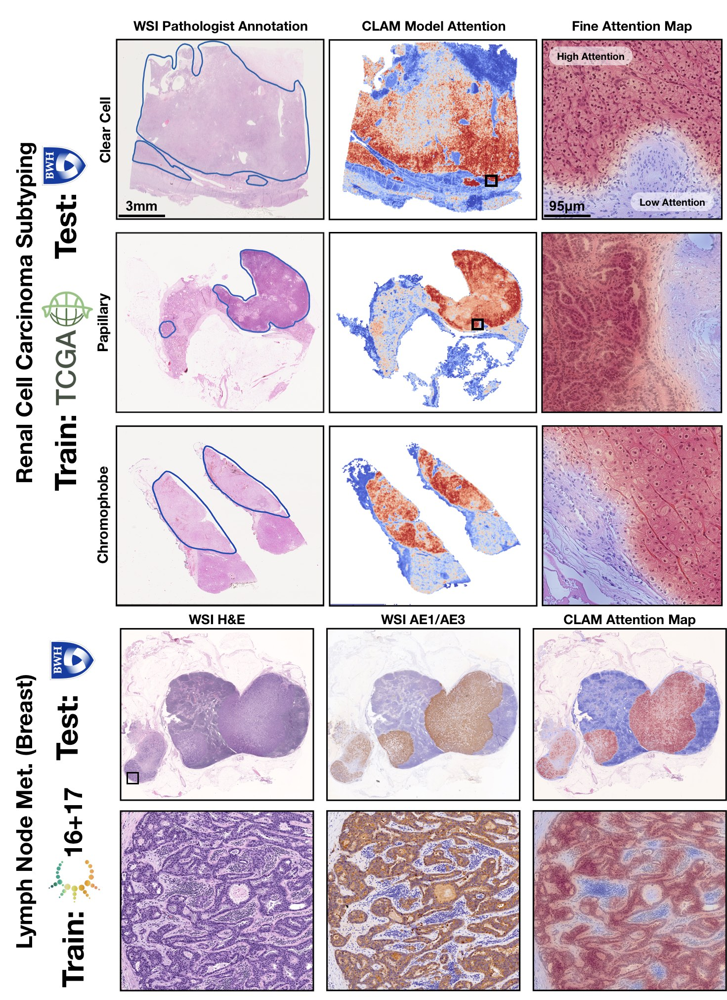

CLAM 
===========
Data Efficient and Weakly Supervised Computational Pathology on Whole Slide Images.

Nature Biomedical Engineering - In Press. 

[ArXiv](https://arxiv.org/abs/2004.09666) | [Interactive Demo](http://clam.mahmoodlab.org) | [Cite](#reference)

***TL;DR:** CLAM is a high-throughput and interpretable method for data efficient whole slide image (WSI) classification using slide-level labels without any ROI extraction or patch-level annotations, and is capable of handling multi-class subtyping problems. Tested on three different WSI datasets, trained models adapt to independent test cohorts of WSI resections and biopsies as well as smartphone microscopy images (photomicrographs).*

[](http://clam.mahmoodlab.org)
## CLAM: A Deep-Learning-based Pipeline for Data Efficient and Weakly Supervised Whole-Slide-level Analysis 
[Pre-requisites](#pre-requisites) • [Installation](INSTALLATION.md) • [Segmentation and Patching](#wsi-segmentation-and-patching) • [Feature Extraction](#weakly-supervised-learning-using-slide-level-labels-with-clam) • [Weakly Supervised Training](#Training-Splits) • [Testing](#Testing-and-Evaluation-Script) • [Trained Models](#Trained-Model-Checkpoints) • [Examples](#examples) • [Pre-print](https://arxiv.org/abs/2004.09666) • [Demo](http://clam.mahmoodlab.org) • [Cite](#reference)

***How does CLAM work?** Clustering-constrained Attention Multiple Instance Learning (CLAM) is a deep-learning-based weakly-supervised method that uses attention-based learning to automatically identify sub-regions of high diagnostic value in order to accurately classify the whole slide, while also utilizing instance-level clustering over the representative regions identified to constrain and refine the feature space.*

© [Mahmood Lab](http://www.mahmoodlab.org) - This code is made available under the GPLv3 License and is available for non-commercial academic purposes. 

## Pre-requisites:
* Linux (Tested on Ubuntu 18.04)
* NVIDIA GPU (Tested on Nvidia GeForce RTX 2080 Ti x 12 on local workstations, and Nvidia P100, K80 GPUs on Google Cloud)
* Python (3.7.5), h5py (2.10.0), matplotlib (3.1.1), numpy (1.17.3), opencv-python (4.1.1.26), openslide-python (1.1.1), openslide (3.4.1), pandas (0.25.3), pillow (6.2.1), PyTorch (1.3.1), scikit-learn (0.22.1), scipy (1.3.1), tensorflow (1.14.0)  , tensorboardx (1.9), torchvision (0.4.2), smooth-topk.

Please refer to our [Installation guide](INSTALLATION.md) for detailed instructions on how to get started.

## WSI Segmentation and Patching 


The first step focuses on segmenting the tissue and excluding any holes. The segmentation of specific slides can be adjusted by tuning the individual parameters (e.g. dilated vessels appearing as holes may be important for certain sarcomas.) 
The following example assumes that digitized whole slide image data in well known standard formats (.svs, .ndpi, .tiff etc.) are stored under a folder named DATA_DIRECTORY

```bash
DATA_DIRECTORY/
	├── slide_1.svs
	├── slide_2.svs
	└── ...
```

### Basic, Fully Automated Run
``` shell
python create_patches.py --source DATA_DIRECTORY --save_dir RESULTS_DIRECTORY --patch_size 256 --seg --patch --stitch
```

The above command will segment every slide in DATA_DIRECTORY using default parameters, extract all patches within the segemnted tissue regions, create a stitched reconstruction for each slide using its extracted patches (optional) and generate the following folder structure at the specified RESULTS_DIRECTORY:

```bash
RESULTS_DIRECTORY/
	├── masks
    		├── slide_1.png
    		├── slide_2.png
    		└── ...
	├── patches
    		├── slide_1.h5
    		├── slide_2.h5
    		└── ...
	├── stitches
    		├── slide_1.png
    		├── slide_2.png
    		└── ...
	└── process_list_autogen.csv
```

The **masks** folder contains the segmentation results (one image per slide).
The **patches** folder contains arrays of extracted tissue patches from each slide along with their coordinates (one .h5 file per slide)
The **stitches** folder contains downsampled visualizations of stitched tissue patches (one image per slide) (Optional, not used for downstream tasks)
The auto-generated csv file **process_list_autogen.csv** contains a list of all slides processed, along with their segmentation/patching parameters used.

Additional flags that can be passed include:
* --custom_downsample: factor for custom downscale (not recommended, ideally should first check if native downsamples exist)
* --patch_level: which downsample pyramid level to extract patches from (default is 0, the highest available resolution)
* --no_auto_skip: by default, the script will skip over files for which patched .h5 files already exist in the desination folder, this toggle can be used to override this behavior

Some parameter templates are also availble and can be readily deployed as good choices for default parameters:
* bwh_biopsy.csv: used for segmenting biopsy slides scanned at BWH (Scanned using Hamamatsu S210 and Aperio GT450) 
* bwh_resection.csv: used for segmenting resection slides scanned at BWH
* tcga.csv: used for segmenting TCGA slides

Simply pass the name of the template file to the --preset argument, for example, to use the biopsy template:
``` shell
python create_patches.py --source DATA_DIRECTORY --save_dir RESULTS_DIRECTORY --patch_size 256 --preset bwh_biopsy.csv --seg --patch --stitch
```
### Custom Default Segmentation Parameters
For advanced usage, in addition to using the default, single set of parameters defined in the script **create_patches.py**, the user can define custom templates of parameters depending on the dataset. These templates are expected to be stored under **presets**, and contain values for each of the parameters used during segmentation and patching. 

The list of segmentation parameters is as follows:
* seg_level: downsample level on which to segment the WSI (default: -1, which uses the downsample in the WSI closest to 64x downsample)
* sthresh: segmentation threshold (positive integer, default: 8, using a higher threshold leads to less foreground and more background detection)
* mthresh: median filter size (positive, odd integer, default: 7)
* use_otsu: use otsu's method instead of simple binary thresholding (default: False) 
* close: additional morphological closing to apply following initial thresholding (positive integer or -1, default: 4)

The list of contour filtering parameters is as follows:
* a_t: area filter threshold for tissue (positive integer, the minimum size of detected foreground contours to consider, relative to a reference patch size of 512 x 512 at level 0, e.g. a value 10 means only detected foreground contours of size greater than 10 512 x 512 sized patches at level 0 will be processed, default: 100)
* a_h: area filter threshold for holes (positive integer, the minimum size of detected holes/cavities in foreground contours to avoid, once again relative to 512 x 512 sized patches at level 0, default: 16)
* max_n_holes: maximum of holes to consider per detected foreground contours (positive integer, default: 10, higher maximum leads to more accurate patching but increases computational cost)

The list of segmentation visualization parameters is as follows:
* vis_level: downsample level to visualize the segmentation results (default: -1, which uses the downsample in the WSI closest to 64x downsample)
* line_thickness: line thickness to draw visualize the segmentation results (positive integer, in terms of number of pixels occupied by drawn line at level 0, default: 250)

The list of patching parameters is as follows:
* white_thresh: saturation threshold under which a patch is to be considered as blank and excluded (positive integer, default: 5)
* black_thresh: mean rgb threshold under which a patch is to be considered as black and excluded (positive integer, default: 50)
* use_padding: whether to pad the border of the slide (default: True)
* contour_fn: contour checking function to decide whether a patch should be considered foreground or background (choices between 'four_pt' - checks if all four points in a small, grid around the center of the patch are inside the contour, 'center' - checks if the center of the patch is inside the contour, 'basic' - checks if the top-left corner of the patch is inside the contour, default: 'four_pt')


### Two-Step Run (Mannually Adjust Parameters For Specific Slides)
To ensure that high quality segmentation and extraction of relevant tissue patches, user has the option of first performing segmentation (typically around 1s per slide), inspecting the segmentation results and tweaking the parameters for select slides if necessary and then extracting patches using the tweaked parameters. i.e., first run:

``` shell
python create_patches.py --source DATA_DIRECTORY --save_dir RESULTS_DIRECTORY --patch_size 256 --seg  
```
The above command will segment every slide in DATA_DIRECTORY using default parameters and generate the csv file, but will NOT patch just yet (**patches** and **stitches** folders will be empty)

The csv file can be tweaked for specific slides, and be passed to the script via the --process_list CSV_FILE_NAME such that the script will use the user-updated specifications. Before tweaking the segmentation parameters, the user should make a copy of the csv file and give it a new name (e.g. process_list_edited.csv) because otherwise this file with the default name is overwritten the next time the command is run. Then the user has the option to tweak the parameters for specific slides by changing their corresponding fields in the csv file. The **process** column stores a binary variable (0 or 1) for whether the script should process a specific slide. This allows the user to toggle on just the select few slides to quickly confirm whether the tweaked parameters produce satisfactory results. For example, to re-segment just slide_1.svs again using user-updated parameters, make the appropriate changes to its fields, update its **process** cell to 1, save the csv file, and pass its name to the same command as above:

``` shell
python create_patches.py --source DATA_DIRECTORY --save_dir RESULTS_DIRECTORY --patch_size 256 --seg --process_list process_list_edited.csv
```

When satisfied with the segmentation results, the user should make the **process** cell for all slides that need to be processed to 1, save the csv file, and run patching with the saved csv file (just like in the fully-automated run use case, with the additional csv file argument):

``` shell
python create_patches.py --source DATA_DIRECTORY --save_dir RESULTS_DIRECTORY --patch_size 256 --seg --process_list CSV_FILE_NAME --patch --stitch
```
## Weakly-Supervised Learning using Slide-Level Labels with CLAM



### Feature Extraction (GPU Example)
A low-dimensional feature representation for each patch may be extracted using a pretrained feature encoder on imagenet or feature encoders trained using self-supervision. Currently feature extraction using a pretrained, modified ResNet50 is implemented..

```shell
CUDA_VISIBLE_DEVICES=0,1 python extract_features.py --data_dir DIR_TO_PATCHES --csv_path CSV_FILE_NAME --feat_dir FEATURES_DIRECTORY --batch_size 512
```

The above command expects the patched .h5 files to be stored under DIR_TO_PATCHES and will use 2 GPUs (0 and 1) and a batch size of 512 to extract 1024-dim features from each tissue patch for each slide and produce the following folder structure:
```bash
FEATURES_DIRECTORY/
    ├── h5_files
            ├── slide_1.h5
            ├── slide_2.h5
            └── ...
    └── pt_files
            ├── slide_1.pt
            ├── slide_2.pt
            └── ...
```
where each .h5 file contains an array of extracted features along with their patch coordinates (note for faster training, a .pt file for each slide is also created for each slide, containing just the patch features). The csv file is expected to contain a list of slide filenames (without the filename extensions) to process (the easiest option is to take the csv file auto generated by the previous segmentation/patching step, and delete the filename extensions)

### Datasets
The data used for training and testing are expected to be organized as follows:
```bash
DATA_ROOT_DIR/
    ├──DATASET_1_DATA_DIR/
        ├── h5_files
                ├── slide_1.h5
                ├── slide_2.h5
                └── ...
        └── pt_files
                ├── slide_1.pt
                ├── slide_2.pt
                └── ...
    ├──DATASET_2_DATA_DIR/
        ├── h5_files
                ├── slide_a.h5
                ├── slide_b.h5
                └── ...
        └── pt_files
                ├── slide_a.pt
                ├── slide_b.pt
                └── ...
    └──DATASET_2_DATA_DIR/
        ├── h5_files
                ├── slide_i.h5
                ├── slide_ii.h5
                └── ...
        └── pt_files
                ├── slide_i.pt
                ├── slide_ii.pt
                └── ...
    └── ...
```
Namely, each dataset is expected to be a subfolder (e.g. DATASET_1_DATA_DIR) under DATA_ROOT_DIR, and the features extracted for each slide in the dataset is stored as a .pt file sitting under the **pt_files** folder of this subfolder.
Datasets are also expected to be prepared in a csv format containing at least 3 columns: **case_id**, **slide_id**, and 1 or more labels columns for the slide-level labels. Each **case_id** is a unique identifier for a patient, while the **slide_id** is a unique identifier for a slide that correspond to the name of an extracted feature .pt file. This is necessary because often one patient has multiple slides, which might also have different labels. When train/val/test splits are created, we also make sure that slides from the same patient do not go to different splits. The slide ids should be consistent with what was used during the feature extraction step. We provide 2 dummy examples of such dataset csv files in the **dataset_csv** folder: one for binary tumor vs. normal classification (task 1) and one for multi-class tumor_subtyping (task 2). 

Dataset objects used for actual training/validation/testing can be constructed using the **Generic_MIL_Dataset** Class (defined in **datasets/dataset_generic.py**). Examples of such dataset objects passed to the models can be found in both **main.py** and **eval.py**. 

For training, look under main.py:
```python 
if args.task == 'task_1_tumor_vs_normal':
    args.n_classes=2
    dataset = Generic_MIL_Dataset(csv_path = 'dataset_csv/tumor_vs_normal_dummy_clean.csv',
                            data_dir= os.path.join(args.data_root_dir, 'tumor_vs_normal_feat_resnet'),
                            shuffle = False, 
                            seed = args.seed, 
                            print_info = True,
                            label_dict = {'normal_tissue':0, 'tumor_tissue':1},
                            label_col = 'label',
                            ignore=[])
```
The user would need to pass:
* csv_path: the path to the dataset csv file
* data_dir: the path to saved .pt features
* label_dict: a dictionary that maps labels in the label column to numerical values
* label_col: name of the label column (optional, by default it's 'label')
* ignore: labels to ignore (optional, by default it's an empty list)

Finally, the user should add this specific 'task' specified by this dataset object in the --task arguments as shown below:

```python
parser.add_argument('--task', type=str, choices=['task_1_tumor_vs_normal',  'task_2_tumor_subtyping'])
```

### Training Splits
For evaluating the algorithm's performance, multiple folds (e.g. 10-fold) of train/val/test splits can be used. Example 10-fold 80/10/10 splits for the two dummy datasets, using 50% of training data can be found under the **splits** folder. These splits can be automatically generated using the create_splits_seq.py script with minimal modification just like with **main.py**. For example, tumor_vs_normal splits with 75% of training data can be created by calling:
 
``` shell
python create_splits_seq.py --task task_1_tumor_vs_normal --seed 1 --label_frac 0.75 --k 10
```
The script uses the **Generic_WSI_Classification_Dataset** Class for which the constructor expects the same arguments as 
**Generic_MIL_Dataset** (without the data_dir argument). For details, please refer to the dataset definition in **datasets/dataset_generic.py**

### GPU Training Example for Binary Positive vs. Negative Classification (e.g. Lymph Node Status)
``` shell
CUDA_VISIBLE_DEVICES=0 python main.py --drop_out --early_stopping --lr 2e-4 --k 10 --label_frac 0.5 --exp_code task_1_tumor_vs_normal_CLAM_50 --weighted_sample --bag_loss ce --inst_loss svm --task task_1_tumor_vs_normal --model_type clam_sb --log_data --data_root_dir DATA_ROOT_DIR
```

### GPU Training Example for Subtyping Problems (e.g. 3-class RCC Subtyping)
``` shell
CUDA_VISIBLE_DEVICES=0 python main.py --drop_out --early_stopping --lr 2e-4 --k 10 --label_frac 0.5 --exp_code task_2_tumor_subtyping_CLAM_50 --weighted_sample --bag_loss ce --inst_loss svm --task task_2_tumor_subtyping --model_type clam_sb --log_data --subtyping --data_root_dir DATA_ROOT_DIR
``` 

Note: We have included the option to use a single-attention-branch CLAM model, which performs favoribly in most experiments and can be set via --model_type clam_sb (single branch) or clam_mb (multi branch). clam_sb is the default choice. Additionally, the user can adjust the number of patches used for clustering via --B.

By default results will be saved to **results/exp_code** corresponding to the exp_code input argument from the user. If tensorboard logging is enabled (with the arugment toggle --log_data), the user can go into the results folder for the particular experiment, run:
``` shell
tensorboard --logdir=.
```
This should open a browser window and show the logged training/validation statistics in real time. 
For information on each argument, see:
``` shell
python main.py -h
```

### Testing and Evaluation Script
User also has the option of using the evluation script to test the performances of trained models. Examples corresponding to the models trained above are provided below:
``` shell
CUDA_VISIBLE_DEVICES=0 python eval.py --drop_out --k 10 --models_exp_code task_1_tumor_vs_normal_CLAM_50_s1 --save_exp_code task_1_tumor_vs_normal_CLAM_50_s1_cv --task task_1_tumor_vs_normal --model_type clam_sb --results_dir results --data_root_dir DATA_ROOT_DIR
```

``` shell
CUDA_VISIBLE_DEVICES=0 python eval.py --drop_out --k 10 --models_exp_code task_2_tumor_subtyping_CLAM_50_s1 --save_exp_code task_2_tumor_subtyping_CLAM_50_s1_cv --task task_2_tumor_subtyping --model_type clam_sb --results_dir results --data_root_dir DATA_ROOT_DIR
```


Once again, for information on each commandline argument, see:
``` shell
python eval.py -h
```

By adding your own custom datasets into **eval.py** the same way as you do for **main.py**, you can also easily test trained models on independent test sets. 

### Trained Model Checkpoints
For reproducability, all trained models used can be accessed [here](https://drive.google.com/drive/folders/1NZ82z0U_cexP6zkx1mRk-QeJyKWk4Q7z?usp=sharing).
The 3 main folders (**tcga_kidney_cv**, **tcga_cptac_lung_cv** and **camelyon_40x_cv**) correspond to models for RCC subtyping trained on the TCGA, for NSCLC subtyping trained on TCGA and CPTAC and for Lymph Node Metastasis (Breast) detection trained on Camelyon16+17 respectively. In each main folder, each subfolder corresponds to one set of 10-fold cross-validation experiments. For example, the subfolder tcga_kidney_cv_CLAM_50_s1 contains the 10 checkpoints corresponding to the 10 cross-validation folds for TCGA RCC subtyping, trained using CLAM with multi-attention branches using 50% of cases in the full training set. 

For reproducability, these models can be evaluated on data prepared by following the same pipeline described in the sections above by calling **eval.py** with the appropriate arguments that specify the model options (--dropout should be enabled and either --model_type clam_mb or --model_type mil should be set, for evaluation only, --subtyping flag does not make a difference) as well as where the model checkpoints (--results_dir and --models_exp_code) and data (--data_root_dir and --task) are stored.

### Examples

Please refer to our pre-print and [interactive demo](http://clam.mahmoodlab.org) for detailed results on three different problems and adaptability across data sources, imaging devices and tissue content. 

	

Visulize additional examples here: http://clam.mahmoodlab.org

## Issues
- Please report all issues on the public forum.

## License
© [Mahmood Lab](http://www.mahmoodlab.org) - This code is made available under the GPLv3 License and is available for non-commercial academic purposes. 

## Reference
If you find our work useful in your research or if you use parts of this code please consider citing our [paper](https://arxiv.org/abs/2004.09666):
```
@inproceedings{lu2020clam,
  title     = {Data Efficient and Weakly Supervised Computational Pathology on Whole Slide Images},
  author    = {Ming Y. Lu, Drew F. K. Williamson, Tiffany Y. Chen, Richard J. Chen, Matteo Barbieri, Faisal Mahmood},
  booktitle = {Nature Biomedical Engineering - In Press},
  year = {2020}
}
```
