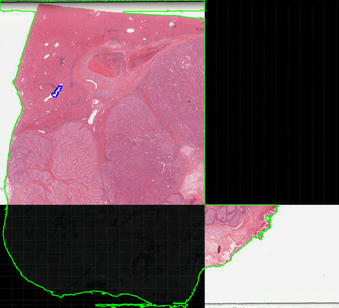
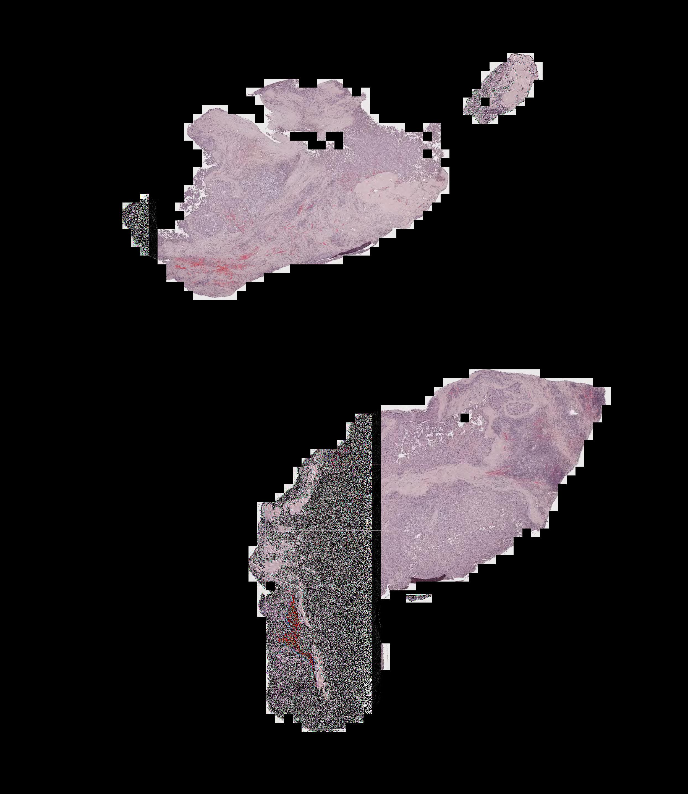

Install Conda Environment for CLAM and Classic MIL
===========

Create conda environment
```shell
conda env create -n clam -f docs/clam.yml
```
It will fail with `CondaEnvException: pip failed` caused by `ERROR: Could not find a version that satisfies the requirement libtiff==0.5.0`.


Some pip dependencies need to be installed manually inside the created environment
```shell
conda activate clam
pip install libtiff openslide_python pyvips gdal mapnik pyproj glymur javabridge -f https://girder.github.io/large_image_wheels
```


Navigate to a path suitable for cloning new repository and install `smooth-topk` (topk==1.0)
```shell
git clone https://github.com/oval-group/smooth-topk.git
cd smooth-topk
python setup.py install
```


Install the rest pip dependencies
```shell
conda deactivate
conda env update --name clam -f docs/clam.yml
```

***
***Possible issues and solutions:***
1. If it fails with `Exception: Error finding javahome on linux: ['bash', '-c', 'java -version']`, and give you a blank output when typing `echo $JAVA_HOME`, you will need to configure java
```shell
sudo add-apt-repository ppa:openjdk-r/ppa
sudo apt-get install openjdk-11-jdk
```
Add `export JAVA_HOME=/usr/lib/jvm/java-11-openjdk-amd64` to `~/.bashrc`. Verify `echo $JAVA_HOME` again to ensure that you have configured it correctly. And continue the installation
```shell
source ~/.bashrc # for current user
conda deactivate
conda env update --name clam -f docs/clam.yml
```


It should work this time!


2. After finishing the installation, if encounter the following error when executing `pip check` or other command
`ModuleNotFoundError: No module named '_distutils_hack'`

Update SetupTools with command
```shell
pip install setuptools --upgrade
```

Another error will be thrown out
`ERROR: openslides 3.0 has requirement setuptools<42.0,>=29.0, but you'll have setuptools 60.1.0 which is incompatible.`

Thus reinstall the previous version
```shell
pip install setuptools==41.0.0
```

Now it should output `No broken requirements found` when executing `pip check` again.

3. For the following segmentation/patching step, if you meet with imcomplete mask (left) or dirty stitched image (right), 

    

it is an issue related to pixman 0.38. To solve this, please download `pixman-0.40.0.tar.gz` from [this link](https://www.cairographics.org/releases/). After navigating into the extracted directory (e.g. ~/Downloads/pixman-0.40.0), type `./configure` to configure the package for your system and type `make` to compile the package. Now you can find a file named `libpixman-1.so.0.40.0`. Use the following commands to replace the 0.38 version one in the ~/anaconda3/lib folder and ~/anaconda3/envs/clam/lib folder.
```shell
sudo cp ~/Downloads/pixman-0.40.0/pixman/.libs/libpixman-1.so.0.40.0 ~/anaconda3/lib/libpixman-1.so.0.38.0
sudo cp ~/Downloads/pixman-0.40.0/pixman/.libs/libpixman-1.so.0.40.0 ~/anaconda3/envs/clam/lib/libpixman-1.so.0.38.0
```

Now redo the process with the broken image should give correct results. See [here](https://github.com/mahmoodlab/CLAM/issues/13) for other workarounds.

4. When reinstall the environment or creating a copy, replacing pixman manually (mentioned above) may lead to a potential error:

`
SafetyError: The package for pixman located at [YOUR_PATH]/anaconda3/pkgs/pixman-0.38.0-h7b6447c_0
appears to be corrupted. The path 'lib/libpixman-1.so.0.38.0'
has an incorrect size.
  reported size: 807544 bytes
  actual size: 5661504 bytes
`

followed by some ClobberErrors. 

In this case, manually removing the folders and files named pixman-0.38* should solve the problem. Remove the partial installed environment and install it again.

